Tutorial for comparing microbial communities between groups (alpha and beta diversity, DA taxa, co-abundance networks with species) when correcting for paired design in all of the above. This tutorial is suitable to run for data that has been generated with either 16S amplicon sequencing or shotgun metagenome sequencing.

Malina Doynova
5/02/2024  
html file in rpubs: https://rpubs.com/malina_19/1181149

# 1. Install and/or load the required packages

``` r
# install.packages("BiocManager")
# BiocManager::install(c("phyloseq", "vegan", "microbiome", "Maaslin2"))
# BiocManager::install(c("microbiomeMarker"))
# BiocManager::install(c("ggplot2", "tidyverse", "dplyr", "data.table"))

library("phyloseq")
library("vegan")
```

    ## Loading required package: permute

    ## Loading required package: lattice

    ## This is vegan 2.6-4

``` r
library("ggplot2")
library("microbiomeMarker")
```

    ## Registered S3 method overwritten by 'gplots':
    ##   method         from     
    ##   reorder.factor DescTools

    ## 
    ## Attaching package: 'microbiomeMarker'

    ## The following object is masked from 'package:phyloseq':
    ## 
    ##     plot_heatmap

``` r
library("tidyverse")
```

    ## ── Attaching core tidyverse packages ──────────────────────── tidyverse 2.0.0 ──
    ## ✔ dplyr     1.1.4     ✔ readr     2.1.5
    ## ✔ forcats   1.0.0     ✔ stringr   1.5.1
    ## ✔ lubridate 1.9.3     ✔ tibble    3.2.1
    ## ✔ purrr     1.0.2     ✔ tidyr     1.3.1

    ## ── Conflicts ────────────────────────────────────────── tidyverse_conflicts() ──
    ## ✖ dplyr::filter() masks stats::filter()
    ## ✖ dplyr::lag()    masks stats::lag()
    ## ℹ Use the conflicted package (<http://conflicted.r-lib.org/>) to force all conflicts to become errors

``` r
library("dplyr")
library("data.table")
```

    ## 
    ## Attaching package: 'data.table'
    ## 
    ## The following objects are masked from 'package:lubridate':
    ## 
    ##     hour, isoweek, mday, minute, month, quarter, second, wday, week,
    ##     yday, year
    ## 
    ## The following objects are masked from 'package:dplyr':
    ## 
    ##     between, first, last
    ## 
    ## The following object is masked from 'package:purrr':
    ## 
    ##     transpose

``` r
library("microbiome")
```

    ## 
    ## microbiome R package (microbiome.github.com)
    ##     
    ## 
    ## 
    ##  Copyright (C) 2011-2022 Leo Lahti, 
    ##     Sudarshan Shetty et al. <microbiome.github.io>
    ## 
    ## 
    ## Attaching package: 'microbiome'
    ## 
    ## The following objects are masked from 'package:microbiomeMarker':
    ## 
    ##     abundances, aggregate_taxa
    ## 
    ## The following object is masked from 'package:ggplot2':
    ## 
    ##     alpha
    ## 
    ## The following object is masked from 'package:vegan':
    ## 
    ##     diversity
    ## 
    ## The following object is masked from 'package:base':
    ## 
    ##     transform

``` r
library("Maaslin2")
library("igraph")
```

    ## 
    ## Attaching package: 'igraph'
    ## 
    ## The following object is masked from 'package:microbiome':
    ## 
    ##     diversity
    ## 
    ## The following objects are masked from 'package:lubridate':
    ## 
    ##     %--%, union
    ## 
    ## The following objects are masked from 'package:dplyr':
    ## 
    ##     as_data_frame, groups, union
    ## 
    ## The following objects are masked from 'package:purrr':
    ## 
    ##     compose, simplify
    ## 
    ## The following object is masked from 'package:tidyr':
    ## 
    ##     crossing
    ## 
    ## The following object is masked from 'package:tibble':
    ## 
    ##     as_data_frame
    ## 
    ## The following object is masked from 'package:microbiomeMarker':
    ## 
    ##     normalize
    ## 
    ## The following object is masked from 'package:vegan':
    ## 
    ##     diversity
    ## 
    ## The following object is masked from 'package:permute':
    ## 
    ##     permute
    ## 
    ## The following objects are masked from 'package:stats':
    ## 
    ##     decompose, spectrum
    ## 
    ## The following object is masked from 'package:base':
    ## 
    ##     union

``` r
library("RColorBrewer")
library("nlme")
```

    ## 
    ## Attaching package: 'nlme'
    ## 
    ## The following object is masked from 'package:dplyr':
    ## 
    ##     collapse

# 2. Set the working directory

``` r
setwd("C://Users//Malina//Desktop//Microbial compositionality")
```

# 3. Load the example dataset

``` r
data(kostic_crc)
kostic_crc
```

    ## phyloseq-class experiment-level object
    ## otu_table()   OTU Table:         [ 2505 taxa and 177 samples ]
    ## sample_data() Sample Data:       [ 177 samples by 71 sample variables ]
    ## tax_table()   Taxonomy Table:    [ 2505 taxa by 7 taxonomic ranks ]

``` r
## Explore the dataset
dim(sample_data(kostic_crc))
```

    ## [1] 177  71

``` r
head(sample_data(kostic_crc))
```

    ##                      X.SampleID BarcodeSequence LinkerPrimerSequence
    ## C0333.N.518126   C0333.N.518126  TCAGATTACGGTTC   CCGTCAATTCMTTTRAGT
    ## C0333.T.518046   C0333.T.518046     TCAGAAGGCAC   CCGTCAATTCMTTTRAGT
    ## 38U4VAHB.518100 38U4VAHB.518100    TCAGTTATCGGC   CCGTCAATTCMTTTRAGT
    ## XZ33PN7O.518030 XZ33PN7O.518030  TCAGACCGGACGAC   CCGTCAATTCMTTTRAGT
    ## GQ6LSNI6.518106 GQ6LSNI6.518106  TCAGCCGAACCGTC   CCGTCAATTCMTTTRAGT
    ## C0270.N.518041   C0270.N.518041   TCAGTTGTTGGAC   CCGTCAATTCMTTTRAGT
    ##                 NECROSIS_PERCENT TARGET_SUBFRAGMENT ASSIGNED_FROM_GEO
    ## C0333.N.518126              None                V35                 n
    ## C0333.T.518046                10                V35                 n
    ## 38U4VAHB.518100             None                V35                 n
    ## XZ33PN7O.518030             None                V35                 n
    ## GQ6LSNI6.518106             None                V35                 n
    ## C0270.N.518041              None                V35                 n
    ##                 EXPERIMENT_CENTER
    ## C0333.N.518126                 BI
    ## C0333.T.518046                 BI
    ## 38U4VAHB.518100                BI
    ## XZ33PN7O.518030                BI
    ## GQ6LSNI6.518106                BI
    ## C0270.N.518041                 BI
    ##                                                                                              TITLE
    ## C0333.N.518126  Genomic analysis identifies association of Fusobacterium with colorectal carcinoma
    ## C0333.T.518046  Genomic analysis identifies association of Fusobacterium with colorectal carcinoma
    ## 38U4VAHB.518100 Genomic analysis identifies association of Fusobacterium with colorectal carcinoma
    ## XZ33PN7O.518030 Genomic analysis identifies association of Fusobacterium with colorectal carcinoma
    ## GQ6LSNI6.518106 Genomic analysis identifies association of Fusobacterium with colorectal carcinoma
    ## C0270.N.518041  Genomic analysis identifies association of Fusobacterium with colorectal carcinoma
    ##                 RUN_PREFIX  AGE NORMAL_EQUIVALENT_PERCENT
    ## C0333.N.518126     GYFWLDK 59.0                      None
    ## C0333.T.518046     GYFWLDK 59.0                        10
    ## 38U4VAHB.518100    GYFWLDK 53.0                      None
    ## XZ33PN7O.518030    GYFWLDK 48.0                      None
    ## GQ6LSNI6.518106    GYFWLDK 81.0                      None
    ## C0270.N.518041     GYFWLDK 85.0                      None
    ##                 FIBROBLAST_AND_VESSEL_PERCENT DEPTH         TREATMENT
    ## C0333.N.518126                           None     0 unaffected mucosa
    ## C0333.T.518046                              5     0             tumor
    ## 38U4VAHB.518100                          None     0             tumor
    ## XZ33PN7O.518030                          None     0 unaffected mucosa
    ## GQ6LSNI6.518106                          None     0 unaffected mucosa
    ## C0270.N.518041                           None     0 unaffected mucosa
    ##                 AGE_AT_DIAGNOSIS          COMMON_NAME HOST_COMMON_NAME
    ## C0333.N.518126              None human gut metagenome            human
    ## C0333.T.518046              None human gut metagenome            human
    ## 38U4VAHB.518100               53 human gut metagenome            human
    ## XZ33PN7O.518030               48 human gut metagenome            human
    ## GQ6LSNI6.518106               81 human gut metagenome            human
    ## C0270.N.518041              None human gut metagenome            human
    ##                             BODY_SITE ELEVATION REPORTS_RECEIVED  CEA
    ## C0333.N.518126  UBERON:colonic mucosa     19.99             None    3
    ## C0333.T.518046  UBERON:colonic mucosa     19.99             None    3
    ## 38U4VAHB.518100 UBERON:colonic mucosa      6.38 Pathology Report None
    ## XZ33PN7O.518030 UBERON:colonic mucosa      6.38 Pathology Report None
    ## GQ6LSNI6.518106 UBERON:colonic mucosa      6.38 Pathology Report None
    ## C0270.N.518041  UBERON:colonic mucosa     19.99             None  1.8
    ##                                                   PCR_PRIMERS COLLECTION_DATE
    ## C0333.N.518126  FWD:CCTACGGGAGGCAGCAG; REV:CCGTCAATTCMTTTRAGT            2011
    ## C0333.T.518046  FWD:CCTACGGGAGGCAGCAG; REV:CCGTCAATTCMTTTRAGT            2011
    ## 38U4VAHB.518100 FWD:CCTACGGGAGGCAGCAG; REV:CCGTCAATTCMTTTRAGT            2011
    ## XZ33PN7O.518030 FWD:CCTACGGGAGGCAGCAG; REV:CCGTCAATTCMTTTRAGT            2011
    ## GQ6LSNI6.518106 FWD:CCTACGGGAGGCAGCAG; REV:CCGTCAATTCMTTTRAGT            2011
    ## C0270.N.518041  FWD:CCTACGGGAGGCAGCAG; REV:CCGTCAATTCMTTTRAGT            2011
    ##                 ALTITUDE                     ENV_BIOME    SEX PLATFORM  RACE
    ## C0333.N.518126         0 ENVO:human-associated habitat female Titanium  None
    ## C0333.T.518046         0 ENVO:human-associated habitat female Titanium  None
    ## 38U4VAHB.518100        0 ENVO:human-associated habitat female Titanium White
    ## XZ33PN7O.518030        0 ENVO:human-associated habitat female Titanium White
    ## GQ6LSNI6.518106        0 ENVO:human-associated habitat female Titanium White
    ## C0270.N.518041         0 ENVO:human-associated habitat female Titanium  None
    ##                             BSP_DIAGNOSIS STUDY_CENTER
    ## C0333.N.518126                       None           BI
    ## C0333.T.518046  Colorectal Adenocarcinoma           BI
    ## 38U4VAHB.518100                      None           BI
    ## XZ33PN7O.518030                      None           BI
    ## GQ6LSNI6.518106                      None           BI
    ## C0270.N.518041                       None           BI
    ##                                      COUNTRY CHEMOTHERAPY YEAR_OF_DEATH
    ## C0333.N.518126                     GAZ:Spain          Yes          None
    ## C0333.T.518046                     GAZ:Spain          Yes          None
    ## 38U4VAHB.518100 GAZ:United States of America         None          None
    ## XZ33PN7O.518030 GAZ:United States of America         None          None
    ## GQ6LSNI6.518106 GAZ:United States of America         None          None
    ## C0270.N.518041                     GAZ:Spain           No          None
    ##                 ETHNICITY ANONYMIZED_NAME TAXON_ID SAMPLE_CENTER SAMP_SIZE
    ## C0333.N.518126       None           C0333   408170            BI      .1,g
    ## C0333.T.518046       None           C0333   408170            BI      .1,g
    ## 38U4VAHB.518100      None           38U4V   408170            BI      .1,g
    ## XZ33PN7O.518030      None           XZ33P   408170            BI      .1,g
    ## GQ6LSNI6.518106      None           GQ6LS   408170            BI      .1,g
    ## C0270.N.518041       None           C0270   408170            BI      .1,g
    ##                 YEAR_OF_BIRTH ORIGINAL_DIAGNOSIS AGE_UNIT STUDY_ID
    ## C0333.N.518126           1949             Normal    years     1457
    ## C0333.T.518046           1949              Tumor    years     1457
    ## 38U4VAHB.518100          1952              Tumor    years     1457
    ## XZ33PN7O.518030          1957             Normal    years     1457
    ## GQ6LSNI6.518106          1925             Normal    years     1457
    ## C0270.N.518041           1922             Normal    years     1457
    ##                                                                      EXPERIMENT_DESIGN_DESCRIPTION
    ## C0333.N.518126  comparison of the gut microbiota in patients with and without colorectal carcinoma
    ## C0333.T.518046  comparison of the gut microbiota in patients with and without colorectal carcinoma
    ## 38U4VAHB.518100 comparison of the gut microbiota in patients with and without colorectal carcinoma
    ## XZ33PN7O.518030 comparison of the gut microbiota in patients with and without colorectal carcinoma
    ## GQ6LSNI6.518106 comparison of the gut microbiota in patients with and without colorectal carcinoma
    ## C0270.N.518041  comparison of the gut microbiota in patients with and without colorectal carcinoma
    ##                 Description_duplicate DIAGNOSIS BODY_HABITAT SEQUENCING_METH
    ## C0333.N.518126      unaffected mucosa   Healthy UBERON:colon  pyrosequencing
    ## C0333.T.518046                  tumor     Tumor UBERON:colon  pyrosequencing
    ## 38U4VAHB.518100                 tumor     Tumor UBERON:colon  pyrosequencing
    ## XZ33PN7O.518030     unaffected mucosa   Healthy UBERON:colon  pyrosequencing
    ## GQ6LSNI6.518106     unaffected mucosa   Healthy UBERON:colon  pyrosequencing
    ## C0270.N.518041      unaffected mucosa   Healthy UBERON:colon  pyrosequencing
    ##                 RUN_DATE                 HISTOLOGIC_GRADE LONGITUDE
    ## C0333.N.518126      2011                             None      2.17
    ## C0333.T.518046      2011 High grade/Poorly-differentiated      2.17
    ## 38U4VAHB.518100     2011                             None    -71.11
    ## XZ33PN7O.518030     2011                             None    -71.11
    ## GQ6LSNI6.518106     2011                             None    -71.11
    ## C0270.N.518041      2011                             None      2.17
    ##                                    ENV_MATTER TARGET_GENE
    ## C0333.N.518126  ENVO:organic material feature    16S rRNA
    ## C0333.T.518046  ENVO:organic material feature    16S rRNA
    ## 38U4VAHB.518100 ENVO:organic material feature    16S rRNA
    ## XZ33PN7O.518030 ENVO:organic material feature    16S rRNA
    ## GQ6LSNI6.518106 ENVO:organic material feature    16S rRNA
    ## C0270.N.518041  ENVO:organic material feature    16S rRNA
    ##                                   ENV_FEATURE KEY_SEQ          BODY_PRODUCT
    ## C0333.N.518126  ENVO:human-associated habitat    None UBERON:colonic mucosa
    ## C0333.T.518046  ENVO:human-associated habitat    None UBERON:colonic mucosa
    ## 38U4VAHB.518100 ENVO:human-associated habitat    None UBERON:colonic mucosa
    ## XZ33PN7O.518030 ENVO:human-associated habitat    None UBERON:colonic mucosa
    ## GQ6LSNI6.518106 ENVO:human-associated habitat    None UBERON:colonic mucosa
    ## C0270.N.518041  ENVO:human-associated habitat    None UBERON:colonic mucosa
    ##                 TUMOR_PERCENT LIBRARY_CONSTRUCTION_PROTOCOL REGION RUN_CENTER
    ## C0333.N.518126              0                 pmid:22009990   None         BI
    ## C0333.T.518046             75                 pmid:22009990   None         BI
    ## 38U4VAHB.518100            75                 pmid:22009990   None         BI
    ## XZ33PN7O.518030             0                 pmid:22009990   None         BI
    ## GQ6LSNI6.518106             0                 pmid:22009990   None         BI
    ## C0270.N.518041              0                 pmid:22009990   None         BI
    ##                 TUMOR_TYPE                                         BSP_NOTES
    ## C0333.N.518126        None                                              None
    ## C0333.T.518046     Primary                                              None
    ## 38U4VAHB.518100    Primary Note from Collab: Cancer located in Sigmoid Colon
    ## XZ33PN7O.518030       None                                              None
    ## GQ6LSNI6.518106       None                                              None
    ## C0270.N.518041        None                                              None
    ##                 RADIATION_THERAPY INFLAMMATION_PERCENT HOST_SUBJECT_ID  PC3
    ## C0333.N.518126                 No                 None      1457:C0333  Low
    ## C0333.T.518046                 No                   10      1457:C0333  Low
    ## 38U4VAHB.518100              None                 None      1457:38U4V High
    ## XZ33PN7O.518030              None                 None      1457:XZ33P High
    ## GQ6LSNI6.518106              None                 None      1457:GQ6LS High
    ## C0270.N.518041                 No                 None      1457:C0270  Low
    ##                 LATITUDE               OSH_DIAGNOSIS     STAGE PRIMARY_DISEASE
    ## C0333.N.518126     41.39                        None pT4_N2_M0    Colon Cancer
    ## C0333.T.518046     41.39 adenocarcinoma of the colon pT4_N2_M0    Colon Cancer
    ## 38U4VAHB.518100    42.37              Adenocarcinoma  Stage_IV    Colon Cancer
    ## XZ33PN7O.518030    42.37                Normal Colon Stage_III    Colon Cancer
    ## GQ6LSNI6.518106    42.37                Normal Colon  Stage_IV    Colon Cancer
    ## C0270.N.518041     41.39                        None pT3_N0_M0    Colon Cancer
    ##                 HOST_TAXID
    ## C0333.N.518126        9606
    ## C0333.T.518046        9606
    ## 38U4VAHB.518100       9606
    ## XZ33PN7O.518030       9606
    ## GQ6LSNI6.518106       9606
    ## C0270.N.518041        9606
    ##                                                                                        Description
    ## C0333.N.518126  Genomic analysis identifies association of Fusobacterium with colorectal carcinoma
    ## C0333.T.518046  Genomic analysis identifies association of Fusobacterium with colorectal carcinoma
    ## 38U4VAHB.518100 Genomic analysis identifies association of Fusobacterium with colorectal carcinoma
    ## XZ33PN7O.518030 Genomic analysis identifies association of Fusobacterium with colorectal carcinoma
    ## GQ6LSNI6.518106 Genomic analysis identifies association of Fusobacterium with colorectal carcinoma
    ## C0270.N.518041  Genomic analysis identifies association of Fusobacterium with colorectal carcinoma

``` r
table(sample_data(kostic_crc)$DIAGNOSIS)
```

    ## 
    ## Healthy   Tumor 
    ##      91      86

``` r
head(tax_table(kostic_crc))
```

    ## Taxonomy Table:     [6 taxa by 7 taxonomic ranks]:
    ##        Kingdom    Phylum           Class                 Order          
    ## 304309 "Bacteria" "Firmicutes"     "Clostridia"          "Clostridiales"
    ## 469478 "Bacteria" "Firmicutes"     "Clostridia"          "Clostridiales"
    ## 208196 "Bacteria" "Proteobacteria" "Alphaproteobacteria" "Rhizobiales"  
    ## 358030 "Bacteria" "Firmicutes"     "Clostridia"          "Clostridiales"
    ## 16076  "Bacteria" "Firmicutes"     "Clostridia"          "Clostridiales"
    ## 35786  "Bacteria" "Firmicutes"     "Clostridia"          "Clostridiales"
    ##        Family                Genus              Species                        
    ## 304309 "Lachnospiraceae"     "Blautia"          "Blautia producta"             
    ## 469478 "Lachnospiraceae"     "Catonella"        NA                             
    ## 208196 "Methylobacteriaceae" "Methylobacterium" "Methylobacterium organophilum"
    ## 358030 NA                    NA                 NA                             
    ## 16076  "Ruminococcaceae"     "Ruminococcus"     "Ruminococcus bromii"          
    ## 35786  "Ruminococcaceae"     NA                 NA

``` r
head(otu_table(kostic_crc)[,1:20])
```

    ## OTU Table:          [6 taxa and 20 samples]
    ##                      taxa are rows
    ##        C0333.N.518126 C0333.T.518046 38U4VAHB.518100 XZ33PN7O.518030
    ## 304309             40              4               1               2
    ## 469478              0              0               0               0
    ## 208196              0              0               0               0
    ## 358030              0              0               0               0
    ## 16076             271             28             110               7
    ## 35786               0              0               0               0
    ##        GQ6LSNI6.518106 C0270.N.518041 HZIMMAM6.518095 LRQ9WN6C.518048
    ## 304309              30              1               4               8
    ## 469478               0              0               0               0
    ## 208196               0              0               0               0
    ## 358030               0              0               0               0
    ## 16076               34              0               0               0
    ## 35786                0              0               0               0
    ##        A8A34NCW.518023 C0332.N.518027 C10.S.517995 MQE9ONGV.518038
    ## 304309               7              2            2               2
    ## 469478               0              0            0               0
    ## 208196               0              0            0               0
    ## 358030               0              0            0               0
    ## 16076                0              8           21               0
    ## 35786                0              0            0               0
    ##        C0230.N.517992 C0256.N.518170 HZIMMNL5.518062 GQ6LSABJ.518010
    ## 304309              1              1               4               7
    ## 469478              0              0               0               0
    ## 208196              0              0               0               0
    ## 358030              0              0               0               0
    ## 16076               3             11               0               9
    ## 35786               0              0               0               0
    ##        C0282.N.518138 TV28INUO.518004 C0315.N.518021 C0235.N.517993
    ## 304309              1               1              1              1
    ## 469478              0               1              0              0
    ## 208196              0               0              0              0
    ## 358030              0               0              0              0
    ## 16076              13               2              7              0
    ## 35786               0               0              0              0

# 4. Function to create a phyloseq object from data files

``` r
create_phyloseq <- function(otu_file, sample_file, tax_file) {
  # Load OTU table
  otu_data <- read.csv(otu_file, row.names = 1, stringsAsFactors = FALSE)
  otu_matrix <- as.matrix(otu_data)
  
  # Load sample data
  sample_data <- read.csv(sample_file, row.names = 1)
  
  # Load taxonomic table
  tax_data <- read.csv(tax_file, row.names = 1, stringsAsFactors = FALSE)
  tax_table <- tax_data[, 1:7]  # Assuming taxonomic ranks are in columns 1 to 7
  
  # Create phyloseq object
  physeq_obj <- phyloseq(otu_table(otu_matrix, taxa_are_rows = TRUE),
                         sample_data,
                         tax_table)
  
  return(physeq_obj)
}

# this is how the function is run

# # Provide file paths
# otu_file <- "path/to/otu_table.csv"
# sample_file <- "path/to/sample_data.csv"
# tax_file <- "path/to/taxonomic_table.csv"
# 
# # Create phyloseq object
# physeq_obj <- create_phyloseq(otu_file, sample_file, tax_file)
```

# 5. Normalization of the sample counts

``` r
## check how large the sample sizes (number of counts) are 

max_difference = max(sample_sums(kostic_crc))/min(sample_sums(kostic_crc))
max_difference
```

    ## [1] 21.34924

``` r
max(sample_sums(kostic_crc))
```

    ## [1] 11187

``` r
min(sample_sums(kostic_crc))
```

    ## [1] 524

``` r
## norm is only needed if sample sizes are more than 10x different (and they are)

## distribution of the sample sizes
hist(sample_sums(kostic_crc), breaks = 177)
```

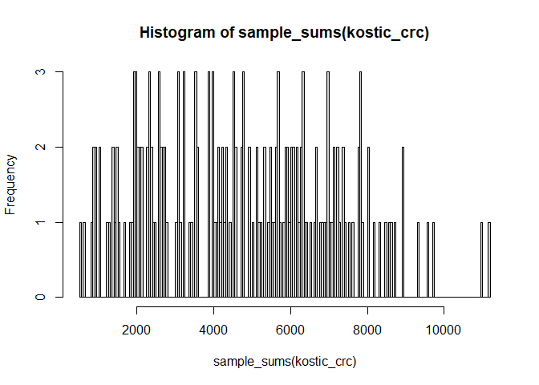<!-- -->

``` r
## get relative abundance with the microbiome package
kostic_crc.compositional <- microbiome::transform(kostic_crc, "compositional")

head(otu_table(kostic_crc.compositional)[,1:20])
```

    ## OTU Table:          [6 taxa and 20 samples]
    ##                      taxa are rows
    ##        C0333.N.518126 C0333.T.518046 38U4VAHB.518100 XZ33PN7O.518030
    ## 304309    0.007078393     0.00311042     0.000152765    0.0004374453
    ## 469478    0.000000000     0.00000000     0.000000000    0.0000000000
    ## 208196    0.000000000     0.00000000     0.000000000    0.0000000000
    ## 358030    0.000000000     0.00000000     0.000000000    0.0000000000
    ## 16076     0.047956114     0.02177294     0.016804155    0.0015310586
    ## 35786     0.000000000     0.00000000     0.000000000    0.0000000000
    ##        GQ6LSNI6.518106 C0270.N.518041 HZIMMAM6.518095 LRQ9WN6C.518048
    ## 304309     0.003442736   0.0001247194    0.0004288624     0.001371507
    ## 469478     0.000000000   0.0000000000    0.0000000000     0.000000000
    ## 208196     0.000000000   0.0000000000    0.0000000000     0.000000000
    ## 358030     0.000000000   0.0000000000    0.0000000000     0.000000000
    ## 16076      0.003901767   0.0000000000    0.0000000000     0.000000000
    ## 35786      0.000000000   0.0000000000    0.0000000000     0.000000000
    ##        A8A34NCW.518023 C0332.N.518027 C10.S.517995 MQE9ONGV.518038
    ## 304309      0.00100416    0.001091107 0.0004409171    0.0007501875
    ## 469478      0.00000000    0.000000000 0.0000000000    0.0000000000
    ## 208196      0.00000000    0.000000000 0.0000000000    0.0000000000
    ## 358030      0.00000000    0.000000000 0.0000000000    0.0000000000
    ## 16076       0.00000000    0.004364430 0.0046296296    0.0000000000
    ## 35786       0.00000000    0.000000000 0.0000000000    0.0000000000
    ##        C0230.N.517992 C0256.N.518170 HZIMMNL5.518062 GQ6LSABJ.518010
    ## 304309   0.0009823183   0.0001157273    0.0006255865         0.00112
    ## 469478   0.0000000000   0.0000000000    0.0000000000         0.00000
    ## 208196   0.0000000000   0.0000000000    0.0000000000         0.00000
    ## 358030   0.0000000000   0.0000000000    0.0000000000         0.00000
    ## 16076    0.0029469548   0.0012730008    0.0000000000         0.00144
    ## 35786    0.0000000000   0.0000000000    0.0000000000         0.00000
    ##        C0282.N.518138 TV28INUO.518004 C0315.N.518021 C0235.N.517993
    ## 304309   0.0005980861    0.0002352941   0.0001344267   0.0006609385
    ## 469478   0.0000000000    0.0002352941   0.0000000000   0.0000000000
    ## 208196   0.0000000000    0.0000000000   0.0000000000   0.0000000000
    ## 358030   0.0000000000    0.0000000000   0.0000000000   0.0000000000
    ## 16076    0.0077751196    0.0004705882   0.0009409867   0.0000000000
    ## 35786    0.0000000000    0.0000000000   0.0000000000   0.0000000000

``` r
## get relative abundance with the microbiomeMarker package
kostic_crc_TSS = microbiomeMarker::normalize(kostic_crc, method="TSS")
head(otu_table(kostic_crc_TSS)[,1:20])
```

    ## OTU Table:          [6 taxa and 20 samples]
    ##                      taxa are rows
    ##        C0333.N.518126 C0333.T.518046 38U4VAHB.518100 XZ33PN7O.518030
    ## 304309    0.007078393     0.00311042     0.000152765    0.0004374453
    ## 469478    0.000000000     0.00000000     0.000000000    0.0000000000
    ## 208196    0.000000000     0.00000000     0.000000000    0.0000000000
    ## 358030    0.000000000     0.00000000     0.000000000    0.0000000000
    ## 16076     0.047956114     0.02177294     0.016804155    0.0015310586
    ## 35786     0.000000000     0.00000000     0.000000000    0.0000000000
    ##        GQ6LSNI6.518106 C0270.N.518041 HZIMMAM6.518095 LRQ9WN6C.518048
    ## 304309     0.003442736   0.0001247194    0.0004288624     0.001371507
    ## 469478     0.000000000   0.0000000000    0.0000000000     0.000000000
    ## 208196     0.000000000   0.0000000000    0.0000000000     0.000000000
    ## 358030     0.000000000   0.0000000000    0.0000000000     0.000000000
    ## 16076      0.003901767   0.0000000000    0.0000000000     0.000000000
    ## 35786      0.000000000   0.0000000000    0.0000000000     0.000000000
    ##        A8A34NCW.518023 C0332.N.518027 C10.S.517995 MQE9ONGV.518038
    ## 304309      0.00100416    0.001091107 0.0004409171    0.0007501875
    ## 469478      0.00000000    0.000000000 0.0000000000    0.0000000000
    ## 208196      0.00000000    0.000000000 0.0000000000    0.0000000000
    ## 358030      0.00000000    0.000000000 0.0000000000    0.0000000000
    ## 16076       0.00000000    0.004364430 0.0046296296    0.0000000000
    ## 35786       0.00000000    0.000000000 0.0000000000    0.0000000000
    ##        C0230.N.517992 C0256.N.518170 HZIMMNL5.518062 GQ6LSABJ.518010
    ## 304309   0.0009823183   0.0001157273    0.0006255865         0.00112
    ## 469478   0.0000000000   0.0000000000    0.0000000000         0.00000
    ## 208196   0.0000000000   0.0000000000    0.0000000000         0.00000
    ## 358030   0.0000000000   0.0000000000    0.0000000000         0.00000
    ## 16076    0.0029469548   0.0012730008    0.0000000000         0.00144
    ## 35786    0.0000000000   0.0000000000    0.0000000000         0.00000
    ##        C0282.N.518138 TV28INUO.518004 C0315.N.518021 C0235.N.517993
    ## 304309   0.0005980861    0.0002352941   0.0001344267   0.0006609385
    ## 469478   0.0000000000    0.0002352941   0.0000000000   0.0000000000
    ## 208196   0.0000000000    0.0000000000   0.0000000000   0.0000000000
    ## 358030   0.0000000000    0.0000000000   0.0000000000   0.0000000000
    ## 16076    0.0077751196    0.0004705882   0.0009409867   0.0000000000
    ## 35786    0.0000000000    0.0000000000   0.0000000000   0.0000000000

``` r
## output of both from above are relative abundances

## css norm (originally from metagenomeSeq packege) ## 
# Cumulative Sum Scaling (CSS) is a median-like quantile normalization which corrects differences in sampling depth (library size).
# While standard relative abundance (fraction/percentage) normalization re-scales all samples to the same total sum (100%), CSS keeps a variation in total counts between samples. 
# CSS re-scales the samples based on a subset (quartile) of lower abundant taxa 
#(relatively constant and independent), 
# thereby excluding the impact of (study dominating) high abundant taxa.

kostic_crc_CSS = microbiomeMarker::normalize(kostic_crc, method="CSS")
```

    ## Default value being used.

``` r
head(otu_table(kostic_crc_CSS)[,1:20])
```

    ## OTU Table:          [6 taxa and 20 samples]
    ##                      taxa are rows
    ##        C0333.N.518126 C0333.T.518046 38U4VAHB.518100 XZ33PN7O.518030
    ## 304309             40              4               1               2
    ## 469478              0              0               0               0
    ## 208196              0              0               0               0
    ## 358030              0              0               0               0
    ## 16076             271             28             110               7
    ## 35786               0              0               0               0
    ##        GQ6LSNI6.518106 C0270.N.518041 HZIMMAM6.518095 LRQ9WN6C.518048
    ## 304309              30              1               4               8
    ## 469478               0              0               0               0
    ## 208196               0              0               0               0
    ## 358030               0              0               0               0
    ## 16076               34              0               0               0
    ## 35786                0              0               0               0
    ##        A8A34NCW.518023 C0332.N.518027 C10.S.517995 MQE9ONGV.518038
    ## 304309               7              2            2               2
    ## 469478               0              0            0               0
    ## 208196               0              0            0               0
    ## 358030               0              0            0               0
    ## 16076                0              8           21               0
    ## 35786                0              0            0               0
    ##        C0230.N.517992 C0256.N.518170 HZIMMNL5.518062 GQ6LSABJ.518010
    ## 304309              1              1               4               7
    ## 469478              0              0               0               0
    ## 208196              0              0               0               0
    ## 358030              0              0               0               0
    ## 16076               3             11               0               9
    ## 35786               0              0               0               0
    ##        C0282.N.518138 TV28INUO.518004 C0315.N.518021 C0235.N.517993
    ## 304309              1               1              1              1
    ## 469478              0               1              0              0
    ## 208196              0               0              0              0
    ## 358030              0               0              0              0
    ## 16076              13               2              7              0
    ## 35786               0               0              0              0

``` r
## cpm norm originally lefse package ###
kostic_crc_CPM = microbiomeMarker::normalize(kostic_crc, method="CPM")

head(otu_table(kostic_crc_CPM)[,1:20])
```

    ## OTU Table:          [6 taxa and 20 samples]
    ##                      taxa are rows
    ##        C0333.N.518126 C0333.T.518046 38U4VAHB.518100 XZ33PN7O.518030
    ## 304309       7078.393        3110.42         152.765        437.4453
    ## 469478          0.000           0.00           0.000          0.0000
    ## 208196          0.000           0.00           0.000          0.0000
    ## 358030          0.000           0.00           0.000          0.0000
    ## 16076       47956.114       21772.94       16804.155       1531.0586
    ## 35786           0.000           0.00           0.000          0.0000
    ##        GQ6LSNI6.518106 C0270.N.518041 HZIMMAM6.518095 LRQ9WN6C.518048
    ## 304309        3442.736       124.7194        428.8624        1371.507
    ## 469478           0.000         0.0000          0.0000           0.000
    ## 208196           0.000         0.0000          0.0000           0.000
    ## 358030           0.000         0.0000          0.0000           0.000
    ## 16076         3901.767         0.0000          0.0000           0.000
    ## 35786            0.000         0.0000          0.0000           0.000
    ##        A8A34NCW.518023 C0332.N.518027 C10.S.517995 MQE9ONGV.518038
    ## 304309         1004.16       1091.107     440.9171        750.1875
    ## 469478            0.00          0.000       0.0000          0.0000
    ## 208196            0.00          0.000       0.0000          0.0000
    ## 358030            0.00          0.000       0.0000          0.0000
    ## 16076             0.00       4364.430    4629.6296          0.0000
    ## 35786             0.00          0.000       0.0000          0.0000
    ##        C0230.N.517992 C0256.N.518170 HZIMMNL5.518062 GQ6LSABJ.518010
    ## 304309       982.3183       115.7273        625.5865            1120
    ## 469478         0.0000         0.0000          0.0000               0
    ## 208196         0.0000         0.0000          0.0000               0
    ## 358030         0.0000         0.0000          0.0000               0
    ## 16076       2946.9548      1273.0008          0.0000            1440
    ## 35786          0.0000         0.0000          0.0000               0
    ##        C0282.N.518138 TV28INUO.518004 C0315.N.518021 C0235.N.517993
    ## 304309       598.0861        235.2941       134.4267       660.9385
    ## 469478         0.0000        235.2941         0.0000         0.0000
    ## 208196         0.0000          0.0000         0.0000         0.0000
    ## 358030         0.0000          0.0000         0.0000         0.0000
    ## 16076       7775.1196        470.5882       940.9867         0.0000
    ## 35786          0.0000          0.0000         0.0000         0.0000

``` r
#tail(otu_table(kostic_crc_CSS))


## rarefy norm ###
## from microbiomeMarker package ##
# 
# kostic_crc_rare = microbiomeMarker::normalize(kostic_crc, method="rarefy")
# 
# head(otu_table(kostic_crc_rare)[,1:20])

## from phyloseq package 

ps.rarefied = phyloseq::rarefy_even_depth(kostic_crc, rngseed=123, sample.size=524, replace=F)
```

    ## `set.seed(123)` was used to initialize repeatable random subsampling.

    ## Please record this for your records so others can reproduce.

    ## Try `set.seed(123); .Random.seed` for the full vector

    ## ...

    ## 1146OTUs were removed because they are no longer 
    ## present in any sample after random subsampling

    ## ...

# 6. Plot stack bar plots of the top 15 taxa based on abund

``` r
##  extract the top 15 taxa on this taxa level for CSS 
top_phy = tax_glom(kostic_crc_CSS, "Genus")
top15 = names(sort(taxa_sums(top_phy), decreasing=TRUE)[1:15])
top15_css_ps = prune_taxa(top15, top_phy)


phyloseq::plot_bar(top15_css_ps, "DIAGNOSIS", fill="Genus")+
  theme( axis.ticks.x=element_blank(), panel.background=element_rect(fill=NA), panel.grid.major=element_line(colour="#ebebeb")) + 
  labs(x=NULL)  
```

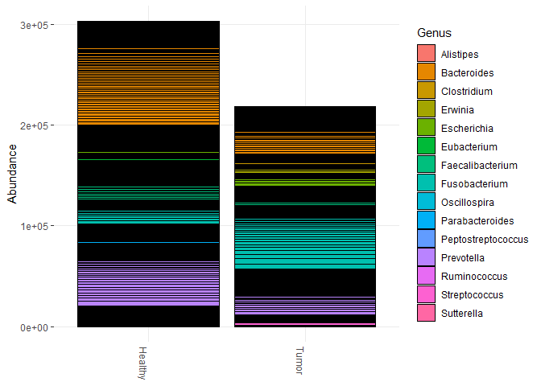<!-- -->

``` r
## get rid of the black squares and get better colors
plot_bar(top15_css_ps, "DIAGNOSIS", fill="Genus")+
  theme( axis.ticks.x=element_blank(), panel.background=element_rect(fill=NA), panel.grid.major=element_line(colour="#ebebeb")) + 
  labs(x=NULL) + geom_bar(stat="identity") 
```

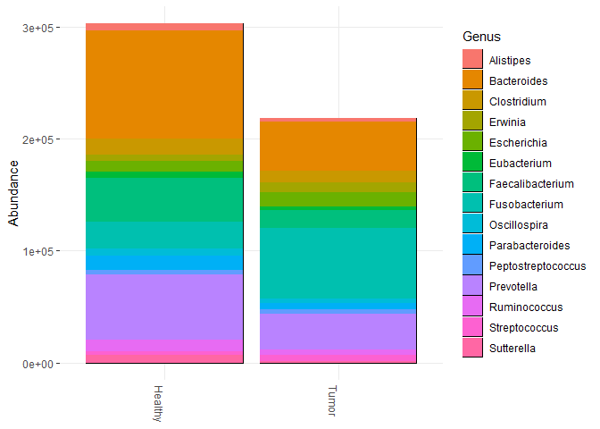<!-- -->

``` r
## Generate 15 distinct colors from the palette

color = grDevices::colors()[grep('gr(a|e)y', grDevices::colors(), invert = T)]
sampled_colors <- sample(color, 15)

plot_bar(top15_css_ps, "DIAGNOSIS", fill = "Genus") +
  theme(axis.ticks.x = element_blank(), panel.background = element_rect(fill = NA), panel.grid.major = element_line(colour = "#ebebeb")) +
  labs(x = NULL) +
  geom_bar(stat = "identity", aes(fill = Genus)) +  # Specify fill aesthetic here
  scale_fill_manual(values = sampled_colors )  # Use scale_fill_manual for fill colors
```

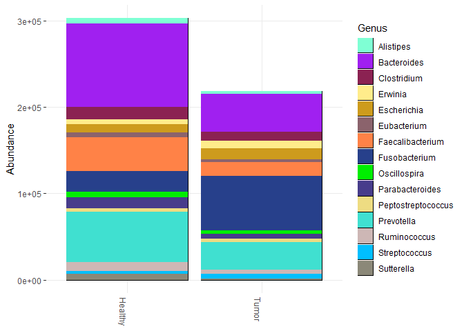<!-- -->

``` r
## plot each genus in a separate facet

# plot_bar(top15_css_ps, "DIAGNOSIS", fill="DIAGNOSIS", facet_grid=~Genus)  + # # #geom_bar(stat="identity")

## plot top 5 ##

top_phy5 = tax_glom(kostic_crc_CSS, "Genus")
top5 = names(sort(taxa_sums(top_phy5), decreasing=TRUE)[1:5])
top5_css_ps = prune_taxa(top5, top_phy5)

tax_table(top5_css_ps)
```

    ## Taxonomy Table:     [5 taxa by 7 taxonomic ranks]:
    ##        Kingdom    Phylum          Class                  Order            
    ## 180285 "Bacteria" "Firmicutes"    "Clostridia"           "Clostridiales"  
    ## 470429 "Bacteria" "Fusobacteria"  "Fusobacteria (class)" "Fusobacteriales"
    ## 49274  "Bacteria" "Firmicutes"    "Clostridia"           "Clostridiales"  
    ## 332077 "Bacteria" "Bacteroidetes" "Bacteroidia"          "Bacteroidales"  
    ## 469709 "Bacteria" "Bacteroidetes" "Bacteroidia"          "Bacteroidales"  
    ##        Family             Genus              Species
    ## 180285 "Ruminococcaceae"  "Faecalibacterium" NA     
    ## 470429 "Fusobacteriaceae" "Fusobacterium"    NA     
    ## 49274  "Lachnospiraceae"  "Clostridium"      NA     
    ## 332077 "Prevotellaceae"   "Prevotella"       NA     
    ## 469709 "Bacteroidaceae"   "Bacteroides"      NA

``` r
## plot each genus in a separate facet
plot_bar(top5_css_ps, "DIAGNOSIS", fill="DIAGNOSIS", facet_grid=~Genus) + geom_bar(stat="identity")
```

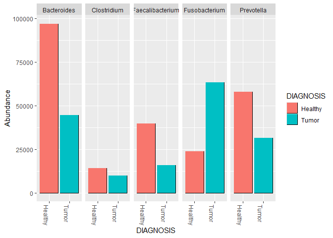<!-- -->

``` r
## changing the appearance 
## https://stackoverflow.com/questions/63133884/removing-the-original-color-outline-in-r-when-using-a-new-pallette-in-a-barplot
## remove black boxes 
## https://github.com/joey711/phyloseq/issues/721

##  extract the top 15 taxa on this taxa level for TSS
top_phy = tax_glom(kostic_crc_TSS, "Genus")
top15 = names(sort(taxa_sums(top_phy), decreasing=TRUE)[1:15])
top15_tss_ps = prune_taxa(top15, top_phy)


# prepare to create a nice plot for saving
top15_tss_G  =plot_bar(top15_tss_ps, "DIAGNOSIS", fill="Genus")+
  theme( axis.ticks.x=element_blank(), panel.background=element_rect(fill=NA), panel.grid.major=element_line(colour="#ebebeb")) + 
  labs(x=NULL)+
  geom_bar(stat = "identity", aes(fill = Genus)) +  
  scale_fill_manual(values = sampled_colors ) +
  theme_bw() +
  theme(
    text = element_text(size = 12, face = "bold"),  # Make all text bold
    axis.title = element_text(size = 14, face = "bold"),  # Make axis titles bold
    axis.text = element_text(size = 12),  # Adjust axis text size
    legend.title = element_text(size = 14, face = "bold"),  # Make legend title bold
    legend.text = element_text(size = 12),  # Adjust legend text size
    plot.title = element_text(size = 16, face = "bold")  # Make plot title bold
  )

  
top15_tss_G
```

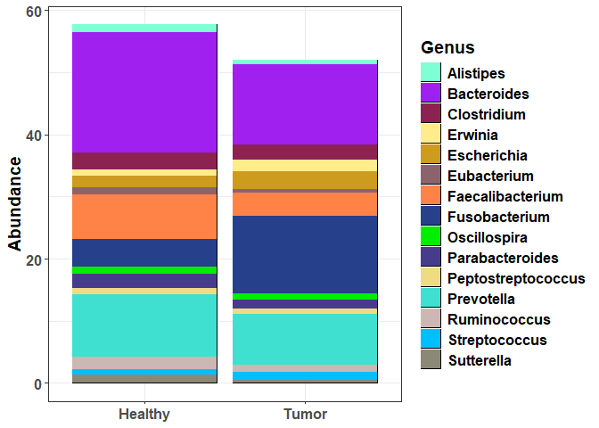<!-- -->

``` r
#save the image
#ggsave("top15_Genera_plot_TSS.png", top15_tss_G, width = 6, height = 8, dpi = 300)

# plot rarefaction curve 
# Extract OTU abundance data and transpose
# otu_table_transposed<- as.data.frame(t(otu_table(kostic_crc)))
# head(otu_table_transposed)
# rarecurve(as.matrix(otu_table_transposed), step=500, cex=0.1)
```

# 7. Plot alpha diversity between groups

``` r
## estimation of alpha div only works with integers and not rel abund values (float numbers)
## what each of the alpha div means 
## Observed - counts the number of unique species (OTUs or ASVs) present in a sample
## Chao1 -  It takes into account the number of rare species (singletons and doubletons) observed in the sample and extrapolates the total richness based on the frequency of these rare species
## ACE -  Takes into account both the number of rare species observed and their relative abundances. inflates the number of rare taxa and inflates again the number of taxa with abundance 1.
## Shannon's diversity index (also known as Shannon-Wiener index) considers both species richness and evenness in a community. It takes into account the number of different species present as well as the relative abundance of each species.
## Simpson's diversity index measures the probability that two randomly selected sequences are of the same species


## CSS ##
alpha_div = plot_richness(kostic_crc_CSS, x="DIAGNOSIS", color="DIAGNOSIS", title="CSS", measures=c("Observed", "Chao1", "ACE", "Simpson", "Shannon")) + 
  geom_boxplot() +
  theme_bw() +
  theme(
    text = element_text(size = 12, face = "bold"),  # Make all text bold
    axis.title = element_text(size = 14, face = "bold"),  # Make axis titles bold
    axis.text = element_text(size = 12),  # Adjust axis text size
    legend.title = element_text(size = 14, face = "bold"),  # Make legend title bold
    legend.text = element_text(size = 12),  # Adjust legend text size
    plot.title = element_text(size = 16, face = "bold")  # Make plot title bold
  )

alpha_div
```

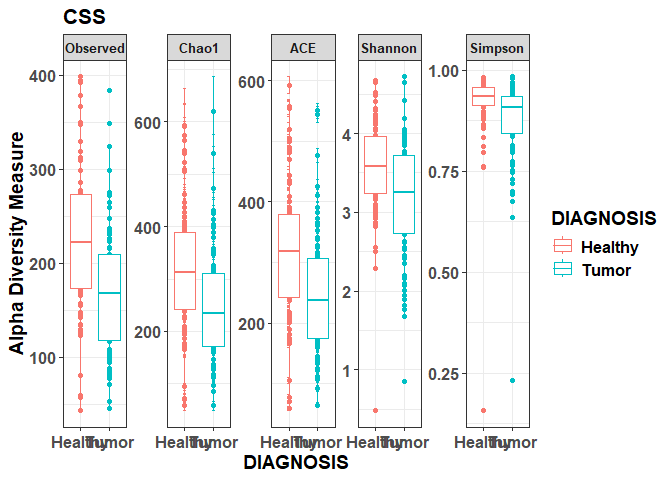<!-- -->

``` r
#save the image
#ggsave("alpha_diversity_plot_CSS.png", alpha_div, width = 10, height = 6, dpi = 300)

## rarefies ##

plot_richness( ps.rarefied, x="DIAGNOSIS", color="DIAGNOSIS", title="rarefied", measures=c("Observed", "Chao1", "ACE", "Simpson", "Shannon")) + 
  geom_boxplot() + 
  theme_bw() 
```

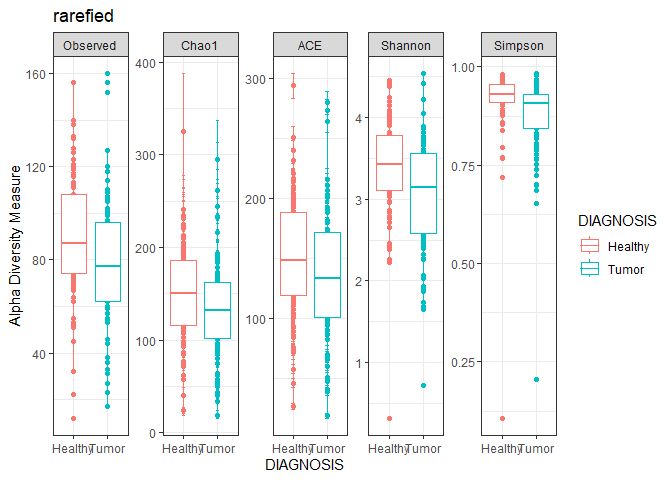<!-- -->

``` r
## stat sign diffrences in alpha?
##https://microbiome.github.io/course_2021_radboud/alpha-diversity.html

## https://rpubs.com/lconteville/713954
richness <- estimate_richness(kostic_crc_CSS)
head(richness)
```

    ##                  Observed    Chao1 se.chao1      ACE    se.ACE  Shannon
    ## C0333.N.518126        213 322.7742 32.76778 345.9554 10.796487 3.789569
    ## C0333.T.518046        139 169.7500 12.47226 176.1841  6.793763 3.999458
    ## X38U4VAHB.518100      216 321.1200 33.81240 308.3320  9.572385 3.953963
    ## XZ33PN7O.518030       177 261.2857 29.79966 247.8873  8.004369 3.672513
    ## GQ6LSNI6.518106       319 436.0000 28.51443 483.5303 12.652176 3.756242
    ## C0270.N.518041        286 418.5000 34.77544 434.5990 11.528188 3.491115
    ##                    Simpson InvSimpson   Fisher
    ## C0333.N.518126   0.9638895   27.69274 43.74733
    ## C0333.T.518046   0.9682210   31.46731 39.58924
    ## X38U4VAHB.518100 0.9694832   32.76880 42.90739
    ## XZ33PN7O.518030  0.9416438   17.13615 36.60411
    ## GQ6LSNI6.518106  0.9472135   18.94425 65.03261
    ## C0270.N.518041   0.9205167   12.58125 57.92391

``` r
## for normally distributed shannon index values 
hist(richness$Shannon, breaks =  25)
```

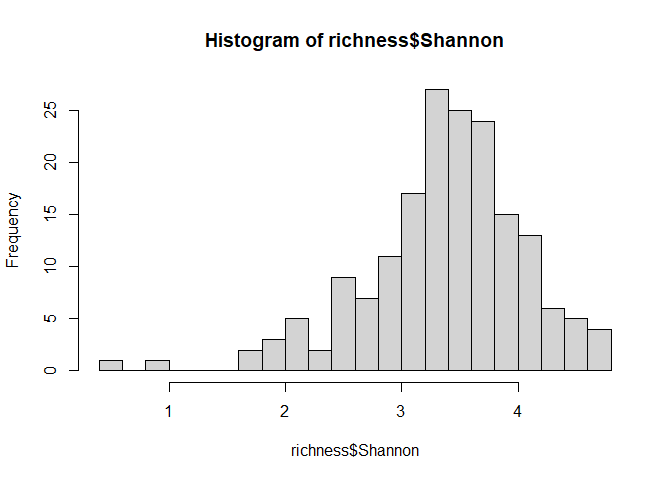<!-- -->

``` r
shapiro_test <- shapiro.test(richness$Shannon)
shapiro_test
```

    ## 
    ##  Shapiro-Wilk normality test
    ## 
    ## data:  richness$Shannon
    ## W = 0.95795, p-value = 3.802e-05

``` r
## almost normally distributed but because of the outliers it is not 
anova.sh = aov(richness$Shannon ~ sample_data(kostic_crc_CSS)$DIAGNOSIS)
summary(anova.sh)
```

    ##                                        Df Sum Sq Mean Sq F value   Pr(>F)    
    ## sample_data(kostic_crc_CSS)$DIAGNOSIS   1   7.53   7.527   17.31 4.97e-05 ***
    ## Residuals                             175  76.10   0.435                     
    ## ---
    ## Signif. codes:  0 '***' 0.001 '**' 0.01 '*' 0.05 '.' 0.1 ' ' 1

``` r
kruskal.test(richness$Shannon ~ sample_data(kostic_crc_CSS)$DIAGNOSIS)
```

    ## 
    ##  Kruskal-Wallis rank sum test
    ## 
    ## data:  richness$Shannon by sample_data(kostic_crc_CSS)$DIAGNOSIS
    ## Kruskal-Wallis chi-squared = 16.548, df = 1, p-value = 4.743e-05

``` r
## because the alpha div is one number per sample we can append this to the metadata of 
## our phyloseq object 

## accounting for the multiple sampling from the same individial
# Load the nlme package

tail(sample_data(kostic_crc_CSS)$ANONYMIZED_NAME)
```

    ## [1] "MQE9O" "32I9U" "UTWNW" "UTWNW" "BFJMK" "32I9U"

``` r
richness_exp <- cbind(richness, DIAGNOSIS = sample_data(kostic_crc_CSS)$DIAGNOSIS, ANONYMIZED_NAME = as.factor(sample_data(kostic_crc_CSS)$ANONYMIZED_NAME))

mixed_model <- lme(Shannon ~ DIAGNOSIS, data = richness_exp, random = ~ 1 | ANONYMIZED_NAME)

summary(mixed_model)
```

    ## Linear mixed-effects model fit by REML
    ##   Data: richness_exp 
    ##        AIC     BIC    logLik
    ##   364.9079 377.567 -178.4539
    ## 
    ## Random effects:
    ##  Formula: ~1 | ANONYMIZED_NAME
    ##         (Intercept)  Residual
    ## StdDev:   0.3081981 0.5851293
    ## 
    ## Fixed effects:  Shannon ~ DIAGNOSIS 
    ##                    Value  Std.Error DF  t-value p-value
    ## (Intercept)     3.561173 0.06927457 93 51.40664       0
    ## DIAGNOSISTumor -0.414341 0.08859541 82 -4.67678       0
    ##  Correlation: 
    ##                (Intr)
    ## DIAGNOSISTumor -0.618
    ## 
    ## Standardized Within-Group Residuals:
    ##         Min          Q1         Med          Q3         Max 
    ## -4.12130368 -0.46019741  0.05461757  0.57266976  2.52865584 
    ## 
    ## Number of Observations: 177
    ## Number of Groups: 94

``` r
## if you have experimental design where the group you check has more than two levels
## you will have to perform posthoc test in addition to anova and KW

## here is an online tutorial that can help with this
## https://scienceparkstudygroup.github.io/microbiome-lesson/04-alpha-diversity/index.html


## Faith's diversity or PD (Phylogenetic diversity) are based on phylogenetic information for each sample (which we don't have for this data)

# library(biomeUtils)
# data("FuentesIliGutData")
# # reduce size for example
# ps1 <- subset_samples(FuentesIliGutData, ILI == "C")
# ps1 <- prune_taxa(taxa_sums(ps1) > 0, ps1)
# 
# meta_tib <- calculatePD(ps1, justDF = TRUE)
# # check
# meta_tib[c(1, 2, 3), c("PD", "SR")]
# #>                 PD  SR
# #> sample_1  967.3003 259
# #> sample_2 1035.1305 291
# #> sample_3 1189.0248 336

## calculate Pielou’s evenness
data_evenness <- vegan::diversity(data.frame(otu_table(kostic_crc_CSS))) / log(specnumber(data.frame(otu_table(kostic_crc_CSS))))
head(data_evenness)
```

    ##    304309    469478    208196    358030     16076     35786 
    ## 0.7162901 0.6620351 0.5970948       NaN 0.7280863 0.5032583

# 8. Estimate and plot the overall dissimilarity (beta diversity) in the microbial composition between the groups

``` r
## beta diversity ##
dist_methods = unlist(distanceMethodList)
dist_methods
```

    ##     UniFrac1     UniFrac2        DPCoA          JSD     vegdist1     vegdist2 
    ##    "unifrac"   "wunifrac"      "dpcoa"        "jsd"  "manhattan"  "euclidean" 
    ##     vegdist3     vegdist4     vegdist5     vegdist6     vegdist7     vegdist8 
    ##   "canberra"       "bray" "kulczynski"    "jaccard"      "gower"   "altGower" 
    ##     vegdist9    vegdist10    vegdist11    vegdist12    vegdist13    vegdist14 
    ##   "morisita"       "horn"  "mountford"       "raup"   "binomial"       "chao" 
    ##    vegdist15   betadiver1   betadiver2   betadiver3   betadiver4   betadiver5 
    ##        "cao"          "w"         "-1"          "c"         "wb"          "r" 
    ##   betadiver6   betadiver7   betadiver8   betadiver9  betadiver10  betadiver11 
    ##          "I"          "e"          "t"         "me"          "j"        "sor" 
    ##  betadiver12  betadiver13  betadiver14  betadiver15  betadiver16  betadiver17 
    ##          "m"         "-2"         "co"         "cc"          "g"         "-3" 
    ##  betadiver18  betadiver19  betadiver20  betadiver21  betadiver22  betadiver23 
    ##          "l"         "19"         "hk"        "rlb"        "sim"         "gl" 
    ##  betadiver24        dist1        dist2        dist3   designdist 
    ##          "z"    "maximum"     "binary"  "minkowski"        "ANY"

``` r
## Jaccard and Bray-Curtis dissimilarities are non-phylogenetic measures that consider the presence/absence and abundance of features in samples, respectively, while UniFrac dissimilarities are phylogenetic measures that 
## incorporate information about the evolutionary relatedness of microbial taxa

physeq2.ord <- phyloseq::ordinate(kostic_crc_CSS, "NMDS", "bray")
```

    ## Square root transformation
    ## Wisconsin double standardization
    ## Run 0 stress 0.2315217 
    ## Run 1 stress 0.2368275 
    ## Run 2 stress 0.2276462 
    ## ... New best solution
    ## ... Procrustes: rmse 0.04290248  max resid 0.3324085 
    ## Run 3 stress 0.2298812 
    ## Run 4 stress 0.2306011 
    ## Run 5 stress 0.2354371 
    ## Run 6 stress 0.2291146 
    ## Run 7 stress 0.2588396 
    ## Run 8 stress 0.2296958 
    ## Run 9 stress 0.2475059 
    ## Run 10 stress 0.2276807 
    ## ... Procrustes: rmse 0.007325219  max resid 0.0690997 
    ## Run 11 stress 0.2278001 
    ## ... Procrustes: rmse 0.04347273  max resid 0.2740757 
    ## Run 12 stress 0.2322912 
    ## Run 13 stress 0.2318017 
    ## Run 14 stress 0.2304156 
    ## Run 15 stress 0.234237 
    ## Run 16 stress 0.2336292 
    ## Run 17 stress 0.2324589 
    ## Run 18 stress 0.2328883 
    ## Run 19 stress 0.2333773 
    ## Run 20 stress 0.2258372 
    ## ... New best solution
    ## ... Procrustes: rmse 0.05437322  max resid 0.3267782 
    ## *** Best solution was not repeated -- monoMDS stopping criteria:
    ##      8: no. of iterations >= maxit
    ##     12: stress ratio > sratmax

``` r
## NMDS is non-linear and focuses on preserving rank order of dissimilarities, PCA is linear and focuses on capturing maximum variance, 
## and PCoA can capture both linear and non-linear relationships and different types of distances measures

#shape is also a parameter we can assign metadata variable to 
p = plot_ordination(kostic_crc_CSS, physeq2.ord, type="samples", color="DIAGNOSIS",
                    title="OTUs")

# Add ellipses
beta_div <- p + stat_ellipse(level = 0.95, type = "norm", geom = "polygon", alpha = 0, aes(color = DIAGNOSIS), size = 1) +
  geom_point(size = 4) + # Adjust the size of points+
  theme_bw() +
  guides(size = "none") + # 
  theme(
    text = element_text(size = 12, face = "bold"),  # Make all text bold
    axis.title = element_text(size = 14, face = "bold"),  # Make axis titles bold
    axis.text = element_text(size = 12),  # Adjust axis text size
    legend.title = element_text(size = 14, face = "bold"),  # Make legend title bold
    legend.text = element_text(size = 12),  # Adjust legend text size
    plot.title = element_text(size = 16, face = "bold")  # Make plot title bold
  )
```

    ## Warning: Using `size` aesthetic for lines was deprecated in ggplot2 3.4.0.
    ## ℹ Please use `linewidth` instead.
    ## This warning is displayed once every 8 hours.
    ## Call `lifecycle::last_lifecycle_warnings()` to see where this warning was
    ## generated.

``` r
beta_div
```

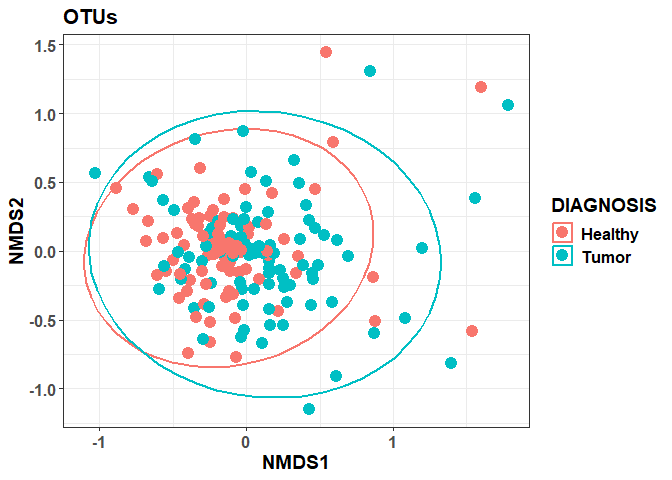<!-- -->

``` r
#save image 
#ggsave("beta_diversity_plot_CSS.png", beta_div , width = 10, height = 6, dpi = 300)


## stat of the beta diversity 

metadata = data.frame(sample_data(kostic_crc_CSS))
phy_beta = phyloseq::distance(kostic_crc_CSS, method = "bray")
adonis2(phy_beta ~ DIAGNOSIS, data = metadata, perm=999)
```

    ## Permutation test for adonis under reduced model
    ## Terms added sequentially (first to last)
    ## Permutation: free
    ## Number of permutations: 999
    ## 
    ## adonis2(formula = phy_beta ~ DIAGNOSIS, data = metadata, permutations = 999)
    ##            Df SumOfSqs      R2      F Pr(>F)    
    ## DIAGNOSIS   1    1.434 0.02351 4.2126  0.001 ***
    ## Residual  175   59.579 0.97649                  
    ## Total     176   61.013 1.00000                  
    ## ---
    ## Signif. codes:  0 '***' 0.001 '**' 0.01 '*' 0.05 '.' 0.1 ' ' 1

``` r
## The adonis2 function fits a multivariate linear model to the distance matrix using the grouping variable (DIAGNOSIS) as a predictor. 
## It then assesses the significance of the relationship between the grouping variable and the structure of the distance matrix through permutation testing.
## it assumes homogeneity of dispersion among groups

## A small p-value suggests that the grouping variable significantly explains the variation in the distance matrix,
## indicating differences in community composition or structure between the groups defined by the DIAGNOSIS variable

## betadisper function checks if the within groups dispersion are homogeneous(compositions vary similarly within the group)

bd = betadisper(phy_beta, metadata$'DIAGNOSIS')
anova(bd)
```

    ## Analysis of Variance Table
    ## 
    ## Response: Distances
    ##            Df  Sum Sq  Mean Sq F value    Pr(>F)    
    ## Groups      1 0.05661 0.056606  12.841 0.0004393 ***
    ## Residuals 175 0.77141 0.004408                      
    ## ---
    ## Signif. codes:  0 '***' 0.001 '**' 0.01 '*' 0.05 '.' 0.1 ' ' 1

``` r
## perform the analyses correcting for multiple sampling from the same individual

## change the sample id to be a factor 

# Extract sample data from the phyloseq object
sample_data <- sample_data(kostic_crc_CSS)
# write.csv(data.frame(sample_data), "sample_data.csv")

# Modify the variable of interest to be a factor
sample_data$ANONYMIZED_NAME <- as.factor(sample_data$ANONYMIZED_NAME)
levels(sample_data$ANONYMIZED_NAME)
```

    ##  [1] "32I9U" "38U4V" "41E1K" "59S9W" "5EKFO" "5TA9V" "6G2KB" "82S3M" "A8A34"
    ## [10] "BFJMK" "C0095" "C0112" "C0133" "C0134" "C0149" "C0154" "C0159" "C0186"
    ## [19] "C0195" "C0198" "C0206" "C0209" "C0211" "C0212" "C0225" "C0230" "C0235"
    ## [28] "C0240" "C0241" "C0252" "C0256" "C0258" "C0268" "C0269" "C0270" "C0271"
    ## [37] "C0275" "C0282" "C0285" "C0294" "C0306" "C0308" "C0311" "C0314" "C0315"
    ## [46] "C0318" "C0322" "C0325" "C0330" "C0332" "C0333" "C0334" "C0335" "C0341"
    ## [55] "C0342" "C0344" "C0349" "C0355" "C0362" "C0366" "C0371" "C0374" "C0378"
    ## [64] "C0388" "C0394" "C0395" "C0398" "C0399" "C1"    "C10"   "C4"    "C6"   
    ## [73] "G2OD5" "G2OD6" "G3UBQ" "GQ6LS" "HZIMM" "I7ROL" "JIDZE" "KIXFR" "LRQ9W"
    ## [82] "MQE9O" "MQETM" "O436F" "OTGGZ" "QFHRS" "R8J9Z" "TV28I" "UEL2G" "UTWNW"
    ## [91] "UZ65X" "XBS5M" "XZ33P" "YOTV6"

``` r
# Replace the modified sample data in the phyloseq object
sample_data(kostic_crc_CSS) <- sample_data


## check relationship between individuals 
plot_ordination(kostic_crc_CSS, physeq2.ord, type="samples", color="ANONYMIZED_NAME",
                title="OTUs")+
  guides(color = FALSE) # no legend 
```

    ## Warning: The `<scale>` argument of `guides()` cannot be `FALSE`. Use "none" instead as
    ## of ggplot2 3.3.4.
    ## This warning is displayed once every 8 hours.
    ## Call `lifecycle::last_lifecycle_warnings()` to see where this warning was
    ## generated.

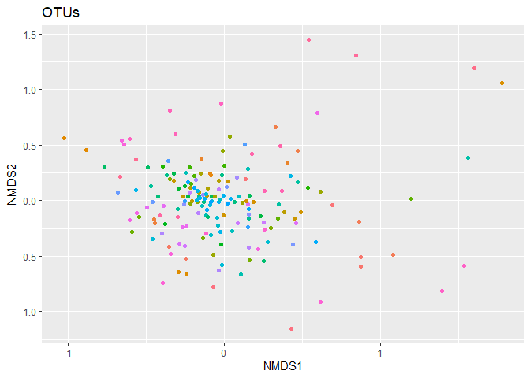<!-- -->

``` r
# Extract the NMDS results from physeq2.ord
nmds_results <- scores(physeq2.ord)

# Combine the NMDS results with the sample IDs
plot_data <- cbind(sample_data(kostic_crc_CSS), nmds_results$sites)

# Plot the ordination
p <- ggplot(plot_data, aes(x = NMDS1, y = NMDS2, color = X.SampleID)) +
  geom_point() +
  labs(title = "OTUs") +
  guides(color = FALSE)

p + geom_text(aes(label = ANONYMIZED_NAME), size =2.5, vjust = -0.5)
```

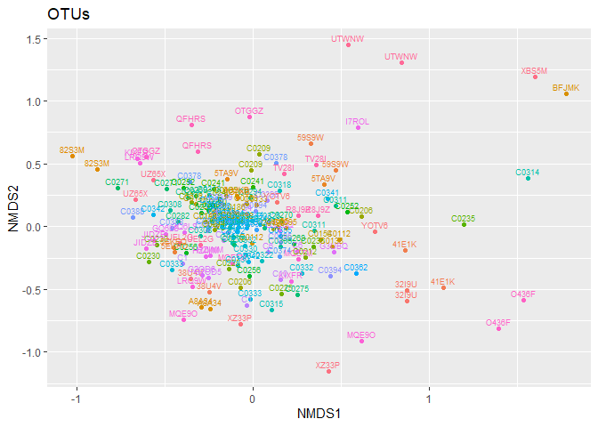<!-- -->

``` r
adonis2(phy_beta ~ metadata$DIAGNOSIS, data = metadata, perm=999, strata = metadata$ANONYMIZED_NAME)
```

    ## Permutation test for adonis under reduced model
    ## Terms added sequentially (first to last)
    ## Blocks:  strata 
    ## Permutation: free
    ## Number of permutations: 999
    ## 
    ## adonis2(formula = phy_beta ~ metadata$DIAGNOSIS, data = metadata, permutations = 999, strata = metadata$ANONYMIZED_NAME)
    ##                     Df SumOfSqs      R2      F Pr(>F)    
    ## metadata$DIAGNOSIS   1    1.434 0.02351 4.2126  0.001 ***
    ## Residual           175   59.579 0.97649                  
    ## Total              176   61.013 1.00000                  
    ## ---
    ## Signif. codes:  0 '***' 0.001 '**' 0.01 '*' 0.05 '.' 0.1 ' ' 1

``` r
## try weighted unifrac for diagnosis 

# phy_tree(kostic_crc_CSS)
# physeq2.ord1<- ordinate(kostic_crc_CSS, "NMDS", "wunifrac") #or unifrac
# we don't have the phy_tree 
# but if we did, we could have also explored this beta_div measure 
```

# 9. Identify DA taxa between groups

``` r
## microbiomeMarker is a wrapper for a lot of R packages specifically designed to 
## profile DA taxa from microbial compositional data 

## lefse ##

## KW detect stat sign features
## Wolcoxon and multigrp_strat test for consistency of stat sign across groups of replicates
## LDA analyses are finally performed to identify the exact effect size of the difference 

## CPM is the default norm method for lefse ##

df_kostic_cpm =normalize(kostic_crc, method = "CPM")%>%microbiomeMarker::run_lefse(
                                       wilcoxon_cutoff = 0.05,
                                       norm = "none",
                                       group = "DIAGNOSIS",
                                       kw_cutoff = 0.05,
                                       multigrp_strat = TRUE,
                                       lda_cutoff = 1.5
)

df_kostic_cpm_table  = (marker_table(df_kostic_cpm))
dim(df_kostic_cpm_table)
# 158 DA taxa across taxa levels 
head(df_kostic_cpm_table)

#write the table
#write.csv(data.frame(df_kostic_cpm_table), "df_kostic_cpm_table_DA.csv")

## results are obtained not only for species but for all taxa levels 
## We can't easily correct for co-founders or repeated measures with these analyses 


### prepare the data for Maaslin2
## MaAsLin2 relies on general linear models to accommodate most modern epidemiological study designs, 
## including cross-sectional and longitudinal, and offers a variety of data exploration, normalization, and transformation methods
## it allows correction for co-founders and repeated measures (correcting for intraindividual variability)


kostic_crc_CPM = microbiomeMarker::normalize(kostic_crc, method = "CPM")

crc_CPM_OTU = data.frame(otu_table(kostic_crc_CPM))
dim(crc_CPM_OTU)
head(crc_CPM_OTU)
crc_CPM_TAXA = data.frame((tax_table(kostic_crc_CPM)))
dim(tax_table(kostic_crc_CPM))
head(crc_CPM_TAXA)
crc_CPM_META = data.frame(sample_data(kostic_crc_CPM))
head(crc_CPM_META)
# These are how they should be 
crc_CPM_TAXA = crc_CPM_TAXA %>% dplyr::mutate(Species1 = paste(rownames(crc_CPM_TAXA), Genus, Species, sep = "_"))
crc_CPM_TAXA = crc_CPM_TAXA %>% dplyr::select(Species1)

head(crc_CPM_TAXA)
head(crc_CPM_OTU[, 1:20])

# Add row names as a column in both data frames
crc_CPM_OTU <- rownames_to_column(crc_CPM_OTU, "RowNames")
crc_CPM_TAXA <- rownames_to_column(crc_CPM_TAXA, "RowNames")

# Merge the two data frames by the new column "RowNames"
crc_CPM_OTU_S <- merge(crc_CPM_OTU, crc_CPM_TAXA, by.x = "RowNames", by.y = "RowNames")
head(crc_CPM_OTU_S)
# Optionally, remove the redundant "RowNames" column after merging
crc_CPM_OTU_S <- crc_CPM_OTU_S %>% dplyr::select(-RowNames)
crc_CPM_OTU_S = column_to_rownames(crc_CPM_OTU_S, "Species1")

crc_CPM_OTU_S = data.frame(t(crc_CPM_OTU_S))
head(crc_CPM_OTU_S)
colnames(crc_CPM_OTU_S) <- sub("X", "", colnames(crc_CPM_OTU_S))

crc_CPM_META$ANONYMIZED_NAME = as.factor(crc_CPM_META$ANONYMIZED_NAME)


head(crc_CPM_OTU_S[1:20, 1:20])
head(crc_CPM_META[1:20, 1:20])

## We will need crc_CPM_OTU_S and crc_CPM_META

fit_data <- Maaslin2(
  crc_CPM_OTU_S, crc_CPM_META, 'C://Users//Malina//Desktop//Microbial compositionality/maaslin_results_random_effect/',
  fixed_effects = c('DIAGNOSIS'),
  normalization = "NONE",
  reference = c("DIAGNOSIS,Healthy"),
  random_effects = c("ANONYMIZED_NAME")
  )


## DA analyses of the same dataset with deseq2
## https://www.bioconductor.org/packages/release/bioc/vignettes/phyloseq/inst/doc/phyloseq-mixture-models.html
```

# 10. Get co-abundance interaction network for either Tumor or Healthy samples

``` r
### will subset the initial CPM norm phyloseq obj to get only the Tumor samples and will
### generate graph from it 
## will subset species that are present at least in 50% of the samples (filtering on prevalence)
## threshold for correlation will be 0.4 (spearman)

kostic_crc_CPM
```

    ## phyloseq-class experiment-level object
    ## otu_table()   OTU Table:         [ 2505 taxa and 177 samples ]
    ## sample_data() Sample Data:       [ 177 samples by 71 sample variables ]
    ## tax_table()   Taxonomy Table:    [ 2505 taxa by 7 taxonomic ranks ]

``` r
subset_kostic_crc <- subset_samples(kostic_crc_CPM, DIAGNOSIS == "Tumor")
# Define the prevalence threshold (e.g., taxa present in at least 50% of samples)
prevalence_threshold <- 0.5

# Filter taxa based on prevalence
subset_kostic_crc <- filter_taxa(subset_kostic_crc , function(x) sum(x > 0) / length(x) >= prevalence_threshold, TRUE)

## create OTU input table with species or genus (when NA is present for species) names
crc_CPM_OTU = data.frame(otu_table(subset_kostic_crc))
dim(crc_CPM_OTU)
```

    ## [1] 70 86

``` r
crc_CPM_TAXA = data.frame((tax_table(subset_kostic_crc)))
dim(tax_table(subset_kostic_crc))
```

    ## [1] 70  7

``` r
crc_CPM_META = data.frame(sample_data(subset_kostic_crc))
head(crc_CPM_META)
```

    ##                      X.SampleID BarcodeSequence LinkerPrimerSequence
    ## C0333.T.518046   C0333.T.518046     TCAGAAGGCAC   CCGTCAATTCMTTTRAGT
    ## 38U4VAHB.518100 38U4VAHB.518100    TCAGTTATCGGC   CCGTCAATTCMTTTRAGT
    ## HZIMMAM6.518095 HZIMMAM6.518095    TCAGTGGTGAAC   CCGTCAATTCMTTTRAGT
    ## GQ6LSABJ.518010 GQ6LSABJ.518010    TCAGACGAGAAC   CCGTCAATTCMTTTRAGT
    ## A8A34AP9.518086 A8A34AP9.518086    TCAGTTCTCAAC   CCGTCAATTCMTTTRAGT
    ## UEL2GAPI.518173 UEL2GAPI.518173    TCAGACTAATTC   CCGTCAATTCMTTTRAGT
    ##                 NECROSIS_PERCENT TARGET_SUBFRAGMENT ASSIGNED_FROM_GEO
    ## C0333.T.518046                10                V35                 n
    ## 38U4VAHB.518100             None                V35                 n
    ## HZIMMAM6.518095             None                V35                 n
    ## GQ6LSABJ.518010             None                V35                 n
    ## A8A34AP9.518086             None                V35                 n
    ## UEL2GAPI.518173             None                V35                 n
    ##                 EXPERIMENT_CENTER
    ## C0333.T.518046                 BI
    ## 38U4VAHB.518100                BI
    ## HZIMMAM6.518095                BI
    ## GQ6LSABJ.518010                BI
    ## A8A34AP9.518086                BI
    ## UEL2GAPI.518173                BI
    ##                                                                                              TITLE
    ## C0333.T.518046  Genomic analysis identifies association of Fusobacterium with colorectal carcinoma
    ## 38U4VAHB.518100 Genomic analysis identifies association of Fusobacterium with colorectal carcinoma
    ## HZIMMAM6.518095 Genomic analysis identifies association of Fusobacterium with colorectal carcinoma
    ## GQ6LSABJ.518010 Genomic analysis identifies association of Fusobacterium with colorectal carcinoma
    ## A8A34AP9.518086 Genomic analysis identifies association of Fusobacterium with colorectal carcinoma
    ## UEL2GAPI.518173 Genomic analysis identifies association of Fusobacterium with colorectal carcinoma
    ##                 RUN_PREFIX  AGE NORMAL_EQUIVALENT_PERCENT
    ## C0333.T.518046     GYFWLDK 59.0                        10
    ## 38U4VAHB.518100    GYFWLDK 53.0                      None
    ## HZIMMAM6.518095    GYFWLDK 79.0                      None
    ## GQ6LSABJ.518010    GYFWLDK 81.0                      None
    ## A8A34AP9.518086    GYFWLDK 65.0                      None
    ## UEL2GAPI.518173    GYFWLDK 59.0                      None
    ##                 FIBROBLAST_AND_VESSEL_PERCENT DEPTH TREATMENT AGE_AT_DIAGNOSIS
    ## C0333.T.518046                              5     0     tumor             None
    ## 38U4VAHB.518100                          None     0     tumor               53
    ## HZIMMAM6.518095                          None     0     tumor               78
    ## GQ6LSABJ.518010                          None     0     tumor               81
    ## A8A34AP9.518086                          None     0     tumor               64
    ## UEL2GAPI.518173                          None     0     tumor               59
    ##                          COMMON_NAME HOST_COMMON_NAME             BODY_SITE
    ## C0333.T.518046  human gut metagenome            human UBERON:colonic mucosa
    ## 38U4VAHB.518100 human gut metagenome            human UBERON:colonic mucosa
    ## HZIMMAM6.518095 human gut metagenome            human UBERON:colonic mucosa
    ## GQ6LSABJ.518010 human gut metagenome            human UBERON:colonic mucosa
    ## A8A34AP9.518086 human gut metagenome            human UBERON:colonic mucosa
    ## UEL2GAPI.518173 human gut metagenome            human UBERON:colonic mucosa
    ##                 ELEVATION REPORTS_RECEIVED  CEA
    ## C0333.T.518046      19.99             None    3
    ## 38U4VAHB.518100      6.38 Pathology Report None
    ## HZIMMAM6.518095      6.38 Pathology Report None
    ## GQ6LSABJ.518010      6.38 Pathology Report None
    ## A8A34AP9.518086      6.38 Pathology Report None
    ## UEL2GAPI.518173      6.38 Pathology report None
    ##                                                   PCR_PRIMERS COLLECTION_DATE
    ## C0333.T.518046  FWD:CCTACGGGAGGCAGCAG; REV:CCGTCAATTCMTTTRAGT            2011
    ## 38U4VAHB.518100 FWD:CCTACGGGAGGCAGCAG; REV:CCGTCAATTCMTTTRAGT            2011
    ## HZIMMAM6.518095 FWD:CCTACGGGAGGCAGCAG; REV:CCGTCAATTCMTTTRAGT            2011
    ## GQ6LSABJ.518010 FWD:CCTACGGGAGGCAGCAG; REV:CCGTCAATTCMTTTRAGT            2011
    ## A8A34AP9.518086 FWD:CCTACGGGAGGCAGCAG; REV:CCGTCAATTCMTTTRAGT            2011
    ## UEL2GAPI.518173 FWD:CCTACGGGAGGCAGCAG; REV:CCGTCAATTCMTTTRAGT            2011
    ##                 ALTITUDE                     ENV_BIOME    SEX PLATFORM  RACE
    ## C0333.T.518046         0 ENVO:human-associated habitat female Titanium  None
    ## 38U4VAHB.518100        0 ENVO:human-associated habitat female Titanium White
    ## HZIMMAM6.518095        0 ENVO:human-associated habitat female Titanium White
    ## GQ6LSABJ.518010        0 ENVO:human-associated habitat female Titanium White
    ## A8A34AP9.518086        0 ENVO:human-associated habitat female Titanium White
    ## UEL2GAPI.518173        0 ENVO:human-associated habitat female Titanium White
    ##                             BSP_DIAGNOSIS STUDY_CENTER
    ## C0333.T.518046  Colorectal Adenocarcinoma           BI
    ## 38U4VAHB.518100                      None           BI
    ## HZIMMAM6.518095                      None           BI
    ## GQ6LSABJ.518010                      None           BI
    ## A8A34AP9.518086                      None           BI
    ## UEL2GAPI.518173                      None           BI
    ##                                      COUNTRY CHEMOTHERAPY YEAR_OF_DEATH
    ## C0333.T.518046                     GAZ:Spain          Yes          None
    ## 38U4VAHB.518100 GAZ:United States of America         None          None
    ## HZIMMAM6.518095 GAZ:United States of America         None          None
    ## GQ6LSABJ.518010 GAZ:United States of America         None          None
    ## A8A34AP9.518086 GAZ:United States of America         None          None
    ## UEL2GAPI.518173 GAZ:United States of America         None          None
    ##                       ETHNICITY ANONYMIZED_NAME TAXON_ID SAMPLE_CENTER
    ## C0333.T.518046             None           C0333   408170            BI
    ## 38U4VAHB.518100            None           38U4V   408170            BI
    ## HZIMMAM6.518095 American Indian           HZIMM   408170            BI
    ## GQ6LSABJ.518010            None           GQ6LS   408170            BI
    ## A8A34AP9.518086            None           A8A34   408170            BI
    ## UEL2GAPI.518173            None           UEL2G   408170            BI
    ##                 SAMP_SIZE YEAR_OF_BIRTH ORIGINAL_DIAGNOSIS AGE_UNIT STUDY_ID
    ## C0333.T.518046       .1,g          1949              Tumor    years     1457
    ## 38U4VAHB.518100      .1,g          1952              Tumor    years     1457
    ## HZIMMAM6.518095      .1,g          1926              Tumor    years     1457
    ## GQ6LSABJ.518010      .1,g          1925              Tumor    years     1457
    ## A8A34AP9.518086      .1,g          1940              Tumor    years     1457
    ## UEL2GAPI.518173      .1,g          1946              Tumor    years     1457
    ##                                                                      EXPERIMENT_DESIGN_DESCRIPTION
    ## C0333.T.518046  comparison of the gut microbiota in patients with and without colorectal carcinoma
    ## 38U4VAHB.518100 comparison of the gut microbiota in patients with and without colorectal carcinoma
    ## HZIMMAM6.518095 comparison of the gut microbiota in patients with and without colorectal carcinoma
    ## GQ6LSABJ.518010 comparison of the gut microbiota in patients with and without colorectal carcinoma
    ## A8A34AP9.518086 comparison of the gut microbiota in patients with and without colorectal carcinoma
    ## UEL2GAPI.518173 comparison of the gut microbiota in patients with and without colorectal carcinoma
    ##                 Description_duplicate DIAGNOSIS BODY_HABITAT SEQUENCING_METH
    ## C0333.T.518046                  tumor     Tumor UBERON:colon  pyrosequencing
    ## 38U4VAHB.518100                 tumor     Tumor UBERON:colon  pyrosequencing
    ## HZIMMAM6.518095                 tumor     Tumor UBERON:colon  pyrosequencing
    ## GQ6LSABJ.518010                 tumor     Tumor UBERON:colon  pyrosequencing
    ## A8A34AP9.518086                 tumor     Tumor UBERON:colon  pyrosequencing
    ## UEL2GAPI.518173                 tumor     Tumor UBERON:colon  pyrosequencing
    ##                 RUN_DATE                 HISTOLOGIC_GRADE LONGITUDE
    ## C0333.T.518046      2011 High grade/Poorly-differentiated      2.17
    ## 38U4VAHB.518100     2011                             None    -71.11
    ## HZIMMAM6.518095     2011                             None    -71.11
    ## GQ6LSABJ.518010     2011                             None    -71.11
    ## A8A34AP9.518086     2011                             None    -71.11
    ## UEL2GAPI.518173     2011                             None    -71.11
    ##                                    ENV_MATTER TARGET_GENE
    ## C0333.T.518046  ENVO:organic material feature    16S rRNA
    ## 38U4VAHB.518100 ENVO:organic material feature    16S rRNA
    ## HZIMMAM6.518095 ENVO:organic material feature    16S rRNA
    ## GQ6LSABJ.518010 ENVO:organic material feature    16S rRNA
    ## A8A34AP9.518086 ENVO:organic material feature    16S rRNA
    ## UEL2GAPI.518173 ENVO:organic material feature    16S rRNA
    ##                                   ENV_FEATURE KEY_SEQ          BODY_PRODUCT
    ## C0333.T.518046  ENVO:human-associated habitat    None UBERON:colonic mucosa
    ## 38U4VAHB.518100 ENVO:human-associated habitat    None UBERON:colonic mucosa
    ## HZIMMAM6.518095 ENVO:human-associated habitat    None UBERON:colonic mucosa
    ## GQ6LSABJ.518010 ENVO:human-associated habitat    None UBERON:colonic mucosa
    ## A8A34AP9.518086 ENVO:human-associated habitat    None UBERON:colonic mucosa
    ## UEL2GAPI.518173 ENVO:human-associated habitat    None UBERON:colonic mucosa
    ##                 TUMOR_PERCENT LIBRARY_CONSTRUCTION_PROTOCOL REGION RUN_CENTER
    ## C0333.T.518046             75                 pmid:22009990   None         BI
    ## 38U4VAHB.518100            75                 pmid:22009990   None         BI
    ## HZIMMAM6.518095            80                 pmid:22009990   None         BI
    ## GQ6LSABJ.518010            80                 pmid:22009990   None         BI
    ## A8A34AP9.518086            85                 pmid:22009990   None         BI
    ## UEL2GAPI.518173            80                 pmid:22009990   None         BI
    ##                 TUMOR_TYPE
    ## C0333.T.518046     Primary
    ## 38U4VAHB.518100    Primary
    ## HZIMMAM6.518095    Primary
    ## GQ6LSABJ.518010    Primary
    ## A8A34AP9.518086    Primary
    ## UEL2GAPI.518173    Primary
    ##                                                                                      BSP_NOTES
    ## C0333.T.518046                                                                            None
    ## 38U4VAHB.518100                              Note from Collab: Cancer located in Sigmoid Colon
    ## HZIMMAM6.518095                            Note from Collab: Cancer located in Ascending Colon
    ## GQ6LSABJ.518010 Note from Collab: Cancer located in Cecum, Lymph Nodes and Metastatic to Liver
    ## A8A34AP9.518086            Note from Collab: Cancer located in Ascending Colon and Lymph Nodes
    ## UEL2GAPI.518173      Note from Collab: Cancer located in Sigmoid Colon, Rectum and Lymph Nodes
    ##                 RADIATION_THERAPY INFLAMMATION_PERCENT HOST_SUBJECT_ID  PC3
    ## C0333.T.518046                 No                   10      1457:C0333  Low
    ## 38U4VAHB.518100              None                 None      1457:38U4V High
    ## HZIMMAM6.518095              None                 None      1457:HZIMM  Low
    ## GQ6LSABJ.518010              None                 None      1457:GQ6LS High
    ## A8A34AP9.518086              None                 None      1457:A8A34 High
    ## UEL2GAPI.518173              None                 None      1457:UEL2G High
    ##                 LATITUDE               OSH_DIAGNOSIS     STAGE PRIMARY_DISEASE
    ## C0333.T.518046     41.39 adenocarcinoma of the colon pT4_N2_M0    Colon Cancer
    ## 38U4VAHB.518100    42.37              Adenocarcinoma  Stage_IV    Colon Cancer
    ## HZIMMAM6.518095    42.37              Adenocarcinoma   Stage_I    Colon Cancer
    ## GQ6LSABJ.518010    42.37              Adenocarcinoma  Stage_IV    Colon Cancer
    ## A8A34AP9.518086    42.37              Adenocarcinoma Stage_III    Colon Cancer
    ## UEL2GAPI.518173    42.37              Adenocarcinoma Stage_III    Colon Cancer
    ##                 HOST_TAXID
    ## C0333.T.518046        9606
    ## 38U4VAHB.518100       9606
    ## HZIMMAM6.518095       9606
    ## GQ6LSABJ.518010       9606
    ## A8A34AP9.518086       9606
    ## UEL2GAPI.518173       9606
    ##                                                                                        Description
    ## C0333.T.518046  Genomic analysis identifies association of Fusobacterium with colorectal carcinoma
    ## 38U4VAHB.518100 Genomic analysis identifies association of Fusobacterium with colorectal carcinoma
    ## HZIMMAM6.518095 Genomic analysis identifies association of Fusobacterium with colorectal carcinoma
    ## GQ6LSABJ.518010 Genomic analysis identifies association of Fusobacterium with colorectal carcinoma
    ## A8A34AP9.518086 Genomic analysis identifies association of Fusobacterium with colorectal carcinoma
    ## UEL2GAPI.518173 Genomic analysis identifies association of Fusobacterium with colorectal carcinoma

``` r
# These are how they should be 
crc_CPM_TAXA = crc_CPM_TAXA %>% dplyr::mutate(Species1= paste(rownames(crc_CPM_TAXA), Genus, Species, sep = "_"))
crc_CPM_TAXA = crc_CPM_TAXA %>% dplyr::select(Species1)

head(crc_CPM_TAXA)
```

    ##                                      Species1
    ## 16076  16076_Ruminococcus_Ruminococcus bromii
    ## 177005                      177005_Blautia_NA
    ## 305760                  305760_Escherichia_NA
    ## 277489   277489_Coprococcus_Coprococcus catus
    ## 321740                 321740_Oscillospira_NA
    ## 194648                           194648_NA_NA

``` r
head(crc_CPM_OTU[, 1:20])
```

    ##        C0333.T.518046 X38U4VAHB.518100 HZIMMAM6.518095 GQ6LSABJ.518010
    ## 16076       21772.939        16804.155          0.0000            1440
    ## 177005       2332.815         5346.777        107.2156            2720
    ## 305760      17107.309          152.765        321.6468               0
    ## 277489          0.000            0.000          0.0000               0
    ## 321740          0.000            0.000        321.6468            6240
    ## 194648          0.000         1833.181       1072.1561           10880
    ##        A8A34AP9.518086 UEL2GAPI.518173 O436FAO8.518097 C0378.T.518104
    ## 16076            0.000           0.000               0       626.0434
    ## 177005           0.000        1318.787               0       104.3406
    ## 305760           0.000        6593.934               0       104.3406
    ## 277489        3604.103        3476.801               0       313.0217
    ## 321740           0.000           0.000               0      1043.4057
    ## 194648           0.000        3117.132               0       626.0434
    ##        R8J9ZAGC.518059 X5TA9VAT9.518088 OTGGZAZO.518108 C0271.T.518078
    ## 16076           0.0000         478.5452       2294.1626       1068.376
    ## 177005        273.3983           0.0000          0.0000          0.000
    ## 305760          0.0000         638.0603       2803.9765       1068.376
    ## 277489        911.3278         159.5151        254.9070          0.000
    ## 321740       3189.6473         797.5754        127.4535       1602.564
    ## 194648          0.0000         638.0603        127.4535       1602.564
    ##        C0159.T.518087 C0318.T.518140 C0209.T.518128 C0112.T.518024
    ## 16076        231.9647         0.0000         0.0000          0.000
    ## 177005       463.9295       127.3399       325.2033          0.000
    ## 305760      9742.5191       127.3399         0.0000       6482.982
    ## 277489      5103.2243         0.0000       650.4065          0.000
    ## 321740      2087.6827      1146.0588       650.4065      11345.219
    ## 194648      2319.6474         0.0000         0.0000       3241.491
    ##        C0355.T.518157 C0240.T.518052 C0268.T.518114 C0285.T.518044
    ## 16076       1548.7868       253.0364       720.4611       479.7314
    ## 177005      2323.1802      1771.2551         0.0000      2398.6568
    ## 305760       516.2623      7085.0202     13688.7608       479.7314
    ## 277489      2839.4424      3542.5101      2161.3833      2878.3881
    ## 321740      2065.0490     11386.6397      2881.8444      2398.6568
    ## 194648      1806.9179      1518.2186      2161.3833       239.8657

``` r
# Add row names as a column in both data frames
crc_CPM_OTU <- rownames_to_column(crc_CPM_OTU, "RowNames")
crc_CPM_TAXA <- rownames_to_column(crc_CPM_TAXA, "RowNames")

# Merge the two data frames by the new column "RowNames"
crc_CPM_OTU_S <- merge(crc_CPM_OTU, crc_CPM_TAXA, by.x = "RowNames", by.y = "RowNames")
head(crc_CPM_OTU_S)
```

    ##   RowNames C0333.T.518046 X38U4VAHB.518100 HZIMMAM6.518095 GQ6LSABJ.518010
    ## 1   127309          0.000        1222.1204        428.8624            4960
    ## 2    13825       1555.210           0.0000          0.0000            1120
    ## 3    14227       3110.420         763.8252          0.0000            2560
    ## 4   145149          0.000         458.2951        321.6468             960
    ## 5    15054        777.605       17415.2154        107.2156            2720
    ## 6   157566      50544.323       22761.9921       1822.6654           54240
    ##   A8A34AP9.518086 UEL2GAPI.518173 O436FAO8.518097 C0378.T.518104
    ## 1       3881.3418           0.000             0.0       104.3406
    ## 2       7485.4450           0.000             0.0       626.0434
    ## 3      12891.5997           0.000         10826.9       417.3623
    ## 4        138.6194           0.000         35052.1       208.6811
    ## 5          0.0000           0.000             0.0      2504.1736
    ## 6        138.6194        6713.823             0.0      2921.5359
    ##   R8J9ZAGC.518059 X5TA9VAT9.518088 OTGGZAZO.518108 C0271.T.518078
    ## 1       455.66390           0.0000        127.4535       2670.940
    ## 2      4374.37346         159.5151        127.4535       5876.068
    ## 3     14490.11209        5583.0276       1401.9883       1602.564
    ## 4         0.00000        7497.2085          0.0000          0.000
    ## 5        91.13278        7497.2085        254.9070          0.000
    ## 6       273.39834        2392.7261          0.0000      11752.137
    ##   C0159.T.518087 C0318.T.518140 C0209.T.518128 C0112.T.518024 C0355.T.518157
    ## 1         0.0000         0.0000      1951.2195          0.000         0.0000
    ## 2       463.9295      1146.0588      3577.2358       1620.746     10583.3764
    ## 3         0.0000       509.3595       650.4065       1620.746      4388.2292
    ## 4       927.8590         0.0000         0.0000          0.000       516.2623
    ## 5         0.0000       254.6797       325.2033      12965.964       258.1311
    ## 6      5103.2243      1910.0981      2276.4228       1620.746      2581.3113
    ##   C0240.T.518052 C0268.T.518114 C0285.T.518044 X41E1KAMA.517991 QFHRSAG2.518005
    ## 1       253.0364       720.4611       719.5970            0.000          0.0000
    ## 2         0.0000      3602.3055       479.7314        16391.106          0.0000
    ## 3         0.0000      2161.3833       239.8657         3848.347          0.0000
    ## 4       506.0729       720.4611         0.0000            0.000          0.0000
    ## 5       253.0364      1440.9222     13912.2092            0.000      77281.5534
    ## 6      2277.3279     34582.1326      9594.6270            0.000        194.1748
    ##   KIXFRARY.518160 UZ65XAS5.518119 C0311.T.518131 X5EKFOAO4.518164
    ## 1        6324.666       1407.1895       112.0951           0.0000
    ## 2           0.000          0.0000      2353.9962           0.0000
    ## 3           0.000          0.0000      1120.9506           0.0000
    ## 4           0.000        255.8526      9191.7946           0.0000
    ## 5           0.000          0.0000         0.0000         170.5321
    ## 6           0.000       6268.3894       448.3802         682.1282
    ##   C0294.T.518134 C0334.T.518147 JIDZEAPD.518149 LRQ9WAHA.518036 C0306.T.518122
    ## 1          0.000       420.2564       2260.9819       3102.3785          0.000
    ## 2       1156.515         0.0000        161.4987          0.0000      13094.418
    ## 3       2698.535       840.5127        322.9974          0.0000       5513.439
    ## 4       3855.050       420.2564          0.0000          0.0000          0.000
    ## 5       2313.030       210.1282          0.0000          0.0000          0.000
    ## 6       3469.545      1681.0254      19702.8424        258.5315      10337.698
    ##   X82S3MAZ4.518145 C4.T.518118 C0388.T.518015 C0308.T.518162 C0211.T.518096
    ## 1        2833.3333      0.0000      33390.411      2035.6234      3140.0966
    ## 2           0.0000  10980.5432          0.000       508.9059         0.0000
    ## 3           0.0000      0.0000       1141.553       508.9059       241.5459
    ## 4           0.0000      0.0000       7705.479      1526.7176         0.0000
    ## 5           0.0000   1348.4878       1141.553         0.0000       241.5459
    ## 6         333.3333    192.6411      13698.630     20865.1399      4589.3720
    ##   C1.T.518120 C0399.T.518153 C0186.T.518019 YOTV6ASH.518142 C0258.T.517997
    ## 1  18368.8464       1418.440       453.0011        1068.376     6346.65236
    ## 2      0.0000       7565.012       906.0023           0.000      536.33682
    ## 3      0.0000       2364.066       226.5006        7478.632       89.38947
    ## 4      0.0000       3309.693         0.0000        5341.880      357.55788
    ## 5    734.7539          0.000         0.0000           0.000       89.38947
    ## 6  12490.8156       4255.319     21517.5538        1068.376    31018.14606
    ##   C0230.T.518144 C0315.T.518034 C0322.T.518018 C0342.T.518093 C0198.T.518166
    ## 1       3444.882      2619.1723       8064.516       1156.069         0.0000
    ## 2          0.000      1047.6689       1152.074          0.000         0.0000
    ## 3          0.000         0.0000       2304.147       6936.416       465.7662
    ## 4        492.126       523.8345       4608.295          0.000         0.0000
    ## 5       3937.008         0.0000          0.000       8092.486      1397.2986
    ## 6       5413.386       523.8345      18433.180      12716.763      6986.4928
    ##   C0395.T.518075 G3UBQAJU.518060 C0335.T.518115 C0349.T.518111 C0149.T.518132
    ## 1         0.0000           0.000      15799.257          0.000      5994.6714
    ## 2     15110.4223        2643.857          0.000          0.000         0.0000
    ## 3         0.0000        4510.109          0.000        368.053       666.0746
    ## 4       387.4467           0.000          0.000       7545.086       666.0746
    ## 5      4649.3607        2643.857          0.000       5336.768         0.0000
    ## 6      1162.3402           0.000       5885.998       1656.238     25310.8348
    ##   C0344.T.518029 C0206.T.518053 C0371.T.518139 C0394.T.518064 C0332.T.518017
    ## 1       1716.738       1104.159       443.9840         0.0000           0.00
    ## 2          0.000        368.053      1331.9520      6944.4444           0.00
    ## 3          0.000          0.000       147.9947       694.4444       11197.24
    ## 4          0.000          0.000       295.9893         0.0000           0.00
    ## 5          0.000      13617.961         0.0000       694.4444           0.00
    ## 6       3004.292        368.053      6067.7816         0.0000       19379.84
    ##   G2OD5ABL.518057 C6.T.518061 C0256.T.518080 C0095.T.518141 C0252.T.518006
    ## 1        5129.753      0.0000       512.0328       3514.056         0.0000
    ## 2           0.000    481.4636       512.0328       1506.024         0.0000
    ## 3        3319.252   2407.3182         0.0000       8032.129      7221.7502
    ## 4        1508.751    481.4636       512.0328        502.008       849.6177
    ## 5       32739.891  56812.7106         0.0000        502.008         0.0000
    ## 6           0.000      0.0000     37378.3922       1004.016      2124.0442
    ##   C0366.T.518172 C0241.T.518067 C0330.T.518035 C0225.T.518033 C0154.T.518091
    ## 1       257.4003      1460.9204       2077.922         0.0000         0.0000
    ## 2         0.0000         0.0000       2077.922         0.0000         0.0000
    ## 3         0.0000      2556.6107          0.000       547.6451      1354.0961
    ## 4       772.2008       730.4602       1038.961         0.0000         0.0000
    ## 5         0.0000      1460.9204       1038.961       182.5484       677.0481
    ## 6     38610.0386      2921.8408      31688.312      2008.0321      1354.0961
    ##   C0270.T.518163 MQETMAZC.518171 C0341.T.518113 C0325.T.518083 C0212.T.518155
    ## 1       842.6966        482.1601         0.0000         0.0000      28625.954
    ## 2         0.0000          0.0000       944.9563         0.0000       1908.397
    ## 3         0.0000       1928.6403         0.0000         0.0000       1908.397
    ## 4      5337.0787        482.1601         0.0000       423.5493       3816.794
    ## 5         0.0000       2892.9605         0.0000       423.5493          0.000
    ## 6       280.8989       2410.8004      1181.1954         0.0000       9541.985
    ##   XZ33PA3O.518135 C0374.T.518127 X59S9WAIH.518013 C0314.T.518025
    ## 1          0.0000      14038.877           0.0000       968.0542
    ## 2          0.0000       2159.827           0.0000         0.0000
    ## 3      13412.3518          0.000         584.7953       322.6847
    ## 4        935.7455       1079.914       30409.3567         0.0000
    ## 5          0.0000          0.000       54093.5673         0.0000
    ## 6          0.0000          0.000           0.0000         0.0000
    ##   X6G2KBASQ.517999 C0133.T.518133 C0235.T.518049 C0362.T.518026 TV28IANZ.518070
    ## 1         1936.733       371.1952         0.0000       246.1236       1534.9194
    ## 2            0.000     17817.3719      1314.0604       492.2471          0.0000
    ## 3            0.000      8908.6860       219.0101         0.0000        383.7299
    ## 4         9038.089      2969.5620         0.0000       492.2471          0.0000
    ## 5         1936.733         0.0000      5694.2619         0.0000     158864.1596
    ## 6         3873.467         0.0000         0.0000       246.1236        767.4597
    ##   C10.T.518056 C0275.T.518032 MQE9OAS7.518008 X32I9UAPQ.518112 UTWNWANU.518168
    ## 1     9852.217        158.303             0.0            0.000          0.0000
    ## 2    14778.325        791.515             0.0         5163.745          0.0000
    ## 3        0.000          0.000             0.0         3940.753          0.0000
    ## 4     1231.527        158.303             0.0          135.888        149.9475
    ## 5        0.000          0.000        112127.6         1766.544      64477.4329
    ## 6    11083.744      24853.570             0.0         5435.521          0.0000
    ##   BFJMKAKB.518159                                               Species1
    ## 1            0.00                                  127309_Bacteroides_NA
    ## 2            0.00                 13825_Dialister_Dialister pneumosintes
    ## 3            0.00 14227_Peptostreptococcus_Peptostreptococcus anaerobius
    ## 4            0.00                                  145149_Veillonella_NA
    ## 5        31537.45            15054_Granulicatella_Granulicatella elegans
    ## 6            0.00                                    157566_Alistipes_NA

``` r
# Optionally, remove the redundant "RowNames" column after merging
crc_CPM_OTU_S <- crc_CPM_OTU_S %>% dplyr::select(-RowNames)
crc_CPM_OTU_S = column_to_rownames(crc_CPM_OTU_S, "Species1")

rownames(crc_CPM_OTU_S) <- sub("X", "", rownames(crc_CPM_OTU_S))
head(crc_CPM_OTU_S[,1:20])
```

    ##                                                        C0333.T.518046
    ## 127309_Bacteroides_NA                                           0.000
    ## 13825_Dialister_Dialister pneumosintes                       1555.210
    ## 14227_Peptostreptococcus_Peptostreptococcus anaerobius       3110.420
    ## 145149_Veillonella_NA                                           0.000
    ## 15054_Granulicatella_Granulicatella elegans                   777.605
    ## 157566_Alistipes_NA                                         50544.323
    ##                                                        X38U4VAHB.518100
    ## 127309_Bacteroides_NA                                         1222.1204
    ## 13825_Dialister_Dialister pneumosintes                           0.0000
    ## 14227_Peptostreptococcus_Peptostreptococcus anaerobius         763.8252
    ## 145149_Veillonella_NA                                          458.2951
    ## 15054_Granulicatella_Granulicatella elegans                  17415.2154
    ## 157566_Alistipes_NA                                          22761.9921
    ##                                                        HZIMMAM6.518095
    ## 127309_Bacteroides_NA                                         428.8624
    ## 13825_Dialister_Dialister pneumosintes                          0.0000
    ## 14227_Peptostreptococcus_Peptostreptococcus anaerobius          0.0000
    ## 145149_Veillonella_NA                                         321.6468
    ## 15054_Granulicatella_Granulicatella elegans                   107.2156
    ## 157566_Alistipes_NA                                          1822.6654
    ##                                                        GQ6LSABJ.518010
    ## 127309_Bacteroides_NA                                             4960
    ## 13825_Dialister_Dialister pneumosintes                            1120
    ## 14227_Peptostreptococcus_Peptostreptococcus anaerobius            2560
    ## 145149_Veillonella_NA                                              960
    ## 15054_Granulicatella_Granulicatella elegans                       2720
    ## 157566_Alistipes_NA                                              54240
    ##                                                        A8A34AP9.518086
    ## 127309_Bacteroides_NA                                        3881.3418
    ## 13825_Dialister_Dialister pneumosintes                       7485.4450
    ## 14227_Peptostreptococcus_Peptostreptococcus anaerobius      12891.5997
    ## 145149_Veillonella_NA                                         138.6194
    ## 15054_Granulicatella_Granulicatella elegans                     0.0000
    ## 157566_Alistipes_NA                                           138.6194
    ##                                                        UEL2GAPI.518173
    ## 127309_Bacteroides_NA                                            0.000
    ## 13825_Dialister_Dialister pneumosintes                           0.000
    ## 14227_Peptostreptococcus_Peptostreptococcus anaerobius           0.000
    ## 145149_Veillonella_NA                                            0.000
    ## 15054_Granulicatella_Granulicatella elegans                      0.000
    ## 157566_Alistipes_NA                                           6713.823
    ##                                                        O436FAO8.518097
    ## 127309_Bacteroides_NA                                              0.0
    ## 13825_Dialister_Dialister pneumosintes                             0.0
    ## 14227_Peptostreptococcus_Peptostreptococcus anaerobius         10826.9
    ## 145149_Veillonella_NA                                          35052.1
    ## 15054_Granulicatella_Granulicatella elegans                        0.0
    ## 157566_Alistipes_NA                                                0.0
    ##                                                        C0378.T.518104
    ## 127309_Bacteroides_NA                                        104.3406
    ## 13825_Dialister_Dialister pneumosintes                       626.0434
    ## 14227_Peptostreptococcus_Peptostreptococcus anaerobius       417.3623
    ## 145149_Veillonella_NA                                        208.6811
    ## 15054_Granulicatella_Granulicatella elegans                 2504.1736
    ## 157566_Alistipes_NA                                         2921.5359
    ##                                                        R8J9ZAGC.518059
    ## 127309_Bacteroides_NA                                        455.66390
    ## 13825_Dialister_Dialister pneumosintes                      4374.37346
    ## 14227_Peptostreptococcus_Peptostreptococcus anaerobius     14490.11209
    ## 145149_Veillonella_NA                                          0.00000
    ## 15054_Granulicatella_Granulicatella elegans                   91.13278
    ## 157566_Alistipes_NA                                          273.39834
    ##                                                        X5TA9VAT9.518088
    ## 127309_Bacteroides_NA                                            0.0000
    ## 13825_Dialister_Dialister pneumosintes                         159.5151
    ## 14227_Peptostreptococcus_Peptostreptococcus anaerobius        5583.0276
    ## 145149_Veillonella_NA                                         7497.2085
    ## 15054_Granulicatella_Granulicatella elegans                   7497.2085
    ## 157566_Alistipes_NA                                           2392.7261
    ##                                                        OTGGZAZO.518108
    ## 127309_Bacteroides_NA                                         127.4535
    ## 13825_Dialister_Dialister pneumosintes                        127.4535
    ## 14227_Peptostreptococcus_Peptostreptococcus anaerobius       1401.9883
    ## 145149_Veillonella_NA                                           0.0000
    ## 15054_Granulicatella_Granulicatella elegans                   254.9070
    ## 157566_Alistipes_NA                                             0.0000
    ##                                                        C0271.T.518078
    ## 127309_Bacteroides_NA                                        2670.940
    ## 13825_Dialister_Dialister pneumosintes                       5876.068
    ## 14227_Peptostreptococcus_Peptostreptococcus anaerobius       1602.564
    ## 145149_Veillonella_NA                                           0.000
    ## 15054_Granulicatella_Granulicatella elegans                     0.000
    ## 157566_Alistipes_NA                                         11752.137
    ##                                                        C0159.T.518087
    ## 127309_Bacteroides_NA                                          0.0000
    ## 13825_Dialister_Dialister pneumosintes                       463.9295
    ## 14227_Peptostreptococcus_Peptostreptococcus anaerobius         0.0000
    ## 145149_Veillonella_NA                                        927.8590
    ## 15054_Granulicatella_Granulicatella elegans                    0.0000
    ## 157566_Alistipes_NA                                         5103.2243
    ##                                                        C0318.T.518140
    ## 127309_Bacteroides_NA                                          0.0000
    ## 13825_Dialister_Dialister pneumosintes                      1146.0588
    ## 14227_Peptostreptococcus_Peptostreptococcus anaerobius       509.3595
    ## 145149_Veillonella_NA                                          0.0000
    ## 15054_Granulicatella_Granulicatella elegans                  254.6797
    ## 157566_Alistipes_NA                                         1910.0981
    ##                                                        C0209.T.518128
    ## 127309_Bacteroides_NA                                       1951.2195
    ## 13825_Dialister_Dialister pneumosintes                      3577.2358
    ## 14227_Peptostreptococcus_Peptostreptococcus anaerobius       650.4065
    ## 145149_Veillonella_NA                                          0.0000
    ## 15054_Granulicatella_Granulicatella elegans                  325.2033
    ## 157566_Alistipes_NA                                         2276.4228
    ##                                                        C0112.T.518024
    ## 127309_Bacteroides_NA                                           0.000
    ## 13825_Dialister_Dialister pneumosintes                       1620.746
    ## 14227_Peptostreptococcus_Peptostreptococcus anaerobius       1620.746
    ## 145149_Veillonella_NA                                           0.000
    ## 15054_Granulicatella_Granulicatella elegans                 12965.964
    ## 157566_Alistipes_NA                                          1620.746
    ##                                                        C0355.T.518157
    ## 127309_Bacteroides_NA                                          0.0000
    ## 13825_Dialister_Dialister pneumosintes                     10583.3764
    ## 14227_Peptostreptococcus_Peptostreptococcus anaerobius      4388.2292
    ## 145149_Veillonella_NA                                        516.2623
    ## 15054_Granulicatella_Granulicatella elegans                  258.1311
    ## 157566_Alistipes_NA                                         2581.3113
    ##                                                        C0240.T.518052
    ## 127309_Bacteroides_NA                                        253.0364
    ## 13825_Dialister_Dialister pneumosintes                         0.0000
    ## 14227_Peptostreptococcus_Peptostreptococcus anaerobius         0.0000
    ## 145149_Veillonella_NA                                        506.0729
    ## 15054_Granulicatella_Granulicatella elegans                  253.0364
    ## 157566_Alistipes_NA                                         2277.3279
    ##                                                        C0268.T.518114
    ## 127309_Bacteroides_NA                                        720.4611
    ## 13825_Dialister_Dialister pneumosintes                      3602.3055
    ## 14227_Peptostreptococcus_Peptostreptococcus anaerobius      2161.3833
    ## 145149_Veillonella_NA                                        720.4611
    ## 15054_Granulicatella_Granulicatella elegans                 1440.9222
    ## 157566_Alistipes_NA                                        34582.1326
    ##                                                        C0285.T.518044
    ## 127309_Bacteroides_NA                                        719.5970
    ## 13825_Dialister_Dialister pneumosintes                       479.7314
    ## 14227_Peptostreptococcus_Peptostreptococcus anaerobius       239.8657
    ## 145149_Veillonella_NA                                          0.0000
    ## 15054_Granulicatella_Granulicatella elegans                13912.2092
    ## 157566_Alistipes_NA                                         9594.6270

``` r
dim(crc_CPM_OTU_S)
```

    ## [1] 70 86

``` r
### build unweighted graph 
correlation_matrix <- cor(data.frame(t(crc_CPM_OTU_S)),method = "spearman")
head(correlation_matrix[,1:5])
```

    ##                                                         X127309_Bacteroides_NA
    ## X127309_Bacteroides_NA                                              1.00000000
    ## X13825_Dialister_Dialister.pneumosintes                            -0.04489624
    ## X14227_Peptostreptococcus_Peptostreptococcus.anaerobius            -0.12919516
    ## X145149_Veillonella_NA                                              0.18438430
    ## X15054_Granulicatella_Granulicatella.elegans                       -0.26004938
    ## X157566_Alistipes_NA                                                0.33367864
    ##                                                         X13825_Dialister_Dialister.pneumosintes
    ## X127309_Bacteroides_NA                                                              -0.04489624
    ## X13825_Dialister_Dialister.pneumosintes                                              1.00000000
    ## X14227_Peptostreptococcus_Peptostreptococcus.anaerobius                              0.27232119
    ## X145149_Veillonella_NA                                                               0.02085916
    ## X15054_Granulicatella_Granulicatella.elegans                                        -0.13407975
    ## X157566_Alistipes_NA                                                                 0.05705999
    ##                                                         X14227_Peptostreptococcus_Peptostreptococcus.anaerobius
    ## X127309_Bacteroides_NA                                                                              -0.12919516
    ## X13825_Dialister_Dialister.pneumosintes                                                              0.27232119
    ## X14227_Peptostreptococcus_Peptostreptococcus.anaerobius                                              1.00000000
    ## X145149_Veillonella_NA                                                                               0.18551504
    ## X15054_Granulicatella_Granulicatella.elegans                                                         0.04136805
    ## X157566_Alistipes_NA                                                                                -0.01130812
    ##                                                         X145149_Veillonella_NA
    ## X127309_Bacteroides_NA                                              0.18438430
    ## X13825_Dialister_Dialister.pneumosintes                             0.02085916
    ## X14227_Peptostreptococcus_Peptostreptococcus.anaerobius             0.18551504
    ## X145149_Veillonella_NA                                              1.00000000
    ## X15054_Granulicatella_Granulicatella.elegans                       -0.09595219
    ## X157566_Alistipes_NA                                                0.10021371
    ##                                                         X15054_Granulicatella_Granulicatella.elegans
    ## X127309_Bacteroides_NA                                                                   -0.26004938
    ## X13825_Dialister_Dialister.pneumosintes                                                  -0.13407975
    ## X14227_Peptostreptococcus_Peptostreptococcus.anaerobius                                   0.04136805
    ## X145149_Veillonella_NA                                                                   -0.09595219
    ## X15054_Granulicatella_Granulicatella.elegans                                              1.00000000
    ## X157566_Alistipes_NA                                                                     -0.16257067

``` r
threshold <- 0.4

# Create an adjacency matrix based on the correlation threshold
adjacency_matrix <- ifelse(abs(correlation_matrix) > threshold, 1, 0)
head(adjacency_matrix[,1:5])
```

    ##                                                         X127309_Bacteroides_NA
    ## X127309_Bacteroides_NA                                                       1
    ## X13825_Dialister_Dialister.pneumosintes                                      0
    ## X14227_Peptostreptococcus_Peptostreptococcus.anaerobius                      0
    ## X145149_Veillonella_NA                                                       0
    ## X15054_Granulicatella_Granulicatella.elegans                                 0
    ## X157566_Alistipes_NA                                                         0
    ##                                                         X13825_Dialister_Dialister.pneumosintes
    ## X127309_Bacteroides_NA                                                                        0
    ## X13825_Dialister_Dialister.pneumosintes                                                       1
    ## X14227_Peptostreptococcus_Peptostreptococcus.anaerobius                                       0
    ## X145149_Veillonella_NA                                                                        0
    ## X15054_Granulicatella_Granulicatella.elegans                                                  0
    ## X157566_Alistipes_NA                                                                          0
    ##                                                         X14227_Peptostreptococcus_Peptostreptococcus.anaerobius
    ## X127309_Bacteroides_NA                                                                                        0
    ## X13825_Dialister_Dialister.pneumosintes                                                                       0
    ## X14227_Peptostreptococcus_Peptostreptococcus.anaerobius                                                       1
    ## X145149_Veillonella_NA                                                                                        0
    ## X15054_Granulicatella_Granulicatella.elegans                                                                  0
    ## X157566_Alistipes_NA                                                                                          0
    ##                                                         X145149_Veillonella_NA
    ## X127309_Bacteroides_NA                                                       0
    ## X13825_Dialister_Dialister.pneumosintes                                      0
    ## X14227_Peptostreptococcus_Peptostreptococcus.anaerobius                      0
    ## X145149_Veillonella_NA                                                       1
    ## X15054_Granulicatella_Granulicatella.elegans                                 0
    ## X157566_Alistipes_NA                                                         0
    ##                                                         X15054_Granulicatella_Granulicatella.elegans
    ## X127309_Bacteroides_NA                                                                             0
    ## X13825_Dialister_Dialister.pneumosintes                                                            0
    ## X14227_Peptostreptococcus_Peptostreptococcus.anaerobius                                            0
    ## X145149_Veillonella_NA                                                                             0
    ## X15054_Granulicatella_Granulicatella.elegans                                                       1
    ## X157566_Alistipes_NA                                                                               0

``` r
# Remove the diagonal values 
diag(adjacency_matrix) <- 0
head(adjacency_matrix[,1:5])
```

    ##                                                         X127309_Bacteroides_NA
    ## X127309_Bacteroides_NA                                                       0
    ## X13825_Dialister_Dialister.pneumosintes                                      0
    ## X14227_Peptostreptococcus_Peptostreptococcus.anaerobius                      0
    ## X145149_Veillonella_NA                                                       0
    ## X15054_Granulicatella_Granulicatella.elegans                                 0
    ## X157566_Alistipes_NA                                                         0
    ##                                                         X13825_Dialister_Dialister.pneumosintes
    ## X127309_Bacteroides_NA                                                                        0
    ## X13825_Dialister_Dialister.pneumosintes                                                       0
    ## X14227_Peptostreptococcus_Peptostreptococcus.anaerobius                                       0
    ## X145149_Veillonella_NA                                                                        0
    ## X15054_Granulicatella_Granulicatella.elegans                                                  0
    ## X157566_Alistipes_NA                                                                          0
    ##                                                         X14227_Peptostreptococcus_Peptostreptococcus.anaerobius
    ## X127309_Bacteroides_NA                                                                                        0
    ## X13825_Dialister_Dialister.pneumosintes                                                                       0
    ## X14227_Peptostreptococcus_Peptostreptococcus.anaerobius                                                       0
    ## X145149_Veillonella_NA                                                                                        0
    ## X15054_Granulicatella_Granulicatella.elegans                                                                  0
    ## X157566_Alistipes_NA                                                                                          0
    ##                                                         X145149_Veillonella_NA
    ## X127309_Bacteroides_NA                                                       0
    ## X13825_Dialister_Dialister.pneumosintes                                      0
    ## X14227_Peptostreptococcus_Peptostreptococcus.anaerobius                      0
    ## X145149_Veillonella_NA                                                       0
    ## X15054_Granulicatella_Granulicatella.elegans                                 0
    ## X157566_Alistipes_NA                                                         0
    ##                                                         X15054_Granulicatella_Granulicatella.elegans
    ## X127309_Bacteroides_NA                                                                             0
    ## X13825_Dialister_Dialister.pneumosintes                                                            0
    ## X14227_Peptostreptococcus_Peptostreptococcus.anaerobius                                            0
    ## X145149_Veillonella_NA                                                                             0
    ## X15054_Granulicatella_Granulicatella.elegans                                                       0
    ## X157566_Alistipes_NA                                                                               0

``` r
graph <- graph_from_adjacency_matrix(adjacency_matrix , 
                                     mode = "undirected")
graph
```

    ## IGRAPH 0ea5a89 UN-- 70 162 -- 
    ## + attr: name (v/c)
    ## + edges from 0ea5a89 (vertex names):
    ## [1] X127309_Bacteroides_NA                 --X203590_NA_NA                            
    ## [2] X127309_Bacteroides_NA                 --X320768_Oscillospira_NA                  
    ## [3] X127309_Bacteroides_NA                 --X470973_Ruminococcus_Ruminococcus.torques
    ## [4] X13825_Dialister_Dialister.pneumosintes--X470239_Dialister_Dialister.invisus      
    ## [5] X13825_Dialister_Dialister.pneumosintes--X470805_NA_Parvimonas.micra              
    ## [6] X13825_Dialister_Dialister.pneumosintes--X500281_NA_NA                            
    ## + ... omitted several edges

``` r
#plot(graph)

#Cluster based on edge betweenness
ceb = cluster_edge_betweenness(graph)

#Extract community memberships from the clustering
community_membership <- membership(ceb)
head(community_membership)
```

    ##                                  X127309_Bacteroides_NA 
    ##                                                       1 
    ##                 X13825_Dialister_Dialister.pneumosintes 
    ##                                                       2 
    ## X14227_Peptostreptococcus_Peptostreptococcus.anaerobius 
    ##                                                       2 
    ##                                  X145149_Veillonella_NA 
    ##                                                       3 
    ##            X15054_Granulicatella_Granulicatella.elegans 
    ##                                                       4 
    ##                                    X157566_Alistipes_NA 
    ##                                                       5

``` r
length(ceb)
```

    ## [1] 22

``` r
# Count the number of nodes in each cluster
cluster_sizes <- table(community_membership)
cluster_sizes
```

    ## community_membership
    ##  1  2  3  4  5  6  7  8  9 10 11 12 13 14 15 16 17 18 19 20 21 22 
    ##  2  9  1  1 25  7  1  3  1  1  2  1  2  1  3  1  1  4  1  1  1  1

``` r
# Add cluster memberships as a vertex attribute
igraph::V(graph)$cluster_membership <- community_membership

# Map cluster memberships to colors using a color palette function
cluster_colors <- rainbow(max(community_membership))
head(cluster_colors)
```

    ## [1] "#FF0000" "#FF4600" "#FF8B00" "#FFD100" "#E8FF00" "#A2FF00"

``` r
# Create a color variable based on cluster memberships
V(graph)$color_variable <- cluster_colors[community_membership]

# vetrex degree
vertex_degrees <- igraph::degree(graph)
head(vertex_degrees)
```

    ##                                  X127309_Bacteroides_NA 
    ##                                                       3 
    ##                 X13825_Dialister_Dialister.pneumosintes 
    ##                                                       4 
    ## X14227_Peptostreptococcus_Peptostreptococcus.anaerobius 
    ##                                                       4 
    ##                                  X145149_Veillonella_NA 
    ##                                                       0 
    ##            X15054_Granulicatella_Granulicatella.elegans 
    ##                                                       0 
    ##                                    X157566_Alistipes_NA 
    ##                                                       6

``` r
# Add vertex degree as a vertex attribute
igraph::V(graph)$degree <- vertex_degrees


vertex.attr = list(
  cluster_membership = V(graph)$cluster_membership,
  name = V(graph)$name,
  degrees = V(graph)$degree,
  color = V(graph)$color_variable)

# Specify the file name for saving the GraphML file
graphml_file <- "T1graph_kostic_CPM_with_metadata_unweighted_undirected.graphml"

# Write the igraph object to GraphML format with metadata
write_graph(
  graph,
  graphml_file,
  format  = "graphml")

# Combine vertex attributes into a data frame
vertex_data <- data.frame(vertex.attr)

head(vertex_data)
```

    ##   cluster_membership                                                    name
    ## 1                  1                                  X127309_Bacteroides_NA
    ## 2                  2                 X13825_Dialister_Dialister.pneumosintes
    ## 3                  2 X14227_Peptostreptococcus_Peptostreptococcus.anaerobius
    ## 4                  3                                  X145149_Veillonella_NA
    ## 5                  4            X15054_Granulicatella_Granulicatella.elegans
    ## 6                  5                                    X157566_Alistipes_NA
    ##   degrees   color
    ## 1       3 #FF0000
    ## 2       4 #FF4600
    ## 3       4 #FF4600
    ## 4       0 #FF8B00
    ## 5       0 #FFD100
    ## 6       6 #E8FF00

``` r
write.csv(vertex_data, "T1vertex_data_kostic_CPM_with_metadata_unweighted_undirected.csv", row.names = FALSE)

## create a function for building co-abundance network

# get_interaction_network = function(norm_phyloseq_obj, group, graphml_file, vertex_data_file){
#   
#   subset_kostic_crc <- subset_samples(norm_phyloseq_obj, DIAGNOSIS == paste(group))
#   # Define the prevalence threshold (e.g., taxa present in at least 50% of samples)
#   prevalence_threshold <- 0.5
#   
#   # Filter taxa based on prevalence
#   subset_kostic_crc <- filter_taxa(subset_kostic_crc , function(x) sum(x > 0) / length(x) >= prevalence_threshold, TRUE)
#   
#   ## create OTU input table with species or genus (when NA is present for species) names
#   crc_CPM_OTU = data.frame(otu_table(subset_kostic_crc))
# 
#   crc_CPM_TAXA = data.frame((tax_table(subset_kostic_crc)))
#  
#   
#   crc_CPM_META = data.frame(sample_data(subset_kostic_crc))
#   
#   # These are how they should be 
#   crc_CPM_TAXA = crc_CPM_TAXA %>% dplyr::mutate(Species1= paste(rownames(crc_CPM_TAXA), Genus, Species, sep = "_"))
#   crc_CPM_TAXA = crc_CPM_TAXA %>% dplyr::select(Species1)
#   
#   
#   # Add row names as a column in both data frames
#   crc_CPM_OTU <- rownames_to_column(crc_CPM_OTU, "RowNames")
#   crc_CPM_TAXA <- rownames_to_column(crc_CPM_TAXA, "RowNames")
#   
#   # Merge the two data frames by the new column "RowNames"
#   crc_CPM_OTU_S <- merge(crc_CPM_OTU, crc_CPM_TAXA, by.x = "RowNames", by.y = "RowNames")
# 
#   # Optionally, remove the redundant "RowNames" column after merging
#   crc_CPM_OTU_S <- crc_CPM_OTU_S %>% dplyr::select(-RowNames)
#   crc_CPM_OTU_S = column_to_rownames(crc_CPM_OTU_S, "Species1")
#   
#   rownames(crc_CPM_OTU_S) <- sub("X", "", rownames(crc_CPM_OTU_S))
#   
#   ### build unweighted graph 
#   correlation_matrix <- cor(data.frame(t(crc_CPM_OTU_S)),method = "spearman")
#  
#   threshold <- 0.4
#   
#   # Create an adjacency matrix based on the correlation threshold
#   adjacency_matrix <- ifelse(abs(correlation_matrix) > threshold, 1, 0)
#  
#   
#   # Remove the diagonal values 
#   diag(adjacency_matrix) <- 0
#   
#   
#   graph <- graph_from_adjacency_matrix(adjacency_matrix , 
#                                        mode = "undirected")
#   
#   
#   #Cluster based on edge betweenness
#   ceb = cluster_edge_betweenness(graph)
#   
#   #Extract community memberships from the clustering
#   community_membership <- membership(ceb)
#   
#   # Count the number of nodes in each cluster
#   cluster_sizes <- table(community_membership)
#   
#   # Add cluster memberships as a vertex attribute
#   igraph::V(graph)$cluster_membership <- community_membership
#   
#   # Map cluster memberships to colors using a color palette function
#   cluster_colors <- rainbow(max(community_membership))
#   
#   # Create a color variable based on cluster memberships
#   V(graph)$color_variable <- cluster_colors[community_membership]
#   
#   # vetrex degree
#   vertex_degrees <- igraph::degree(graph)
#  
#   # Add vertex degree as a vertex attribute
#   igraph::V(graph)$degree <- vertex_degrees
#   
#   vertex.attr = list(
#     cluster_membership = V(graph)$cluster_membership,
#     name = V(graph)$name,
#     degrees = V(graph)$degree,
#     color = V(graph)$color_variable)
#   
#   # Specify the file name for saving the GraphML file
#   graphml_file <- graphml_file
#   
#   # Write the igraph object to GraphML format with metadata
#   write_graph(
#     graph,
#     graphml_file,
#     format  = "graphml")
#   
#   # Combine vertex attributes into a data frame
#   vertex_data <- data.frame(vertex.attr)
#   
#   write.csv(vertex_data, vertex_data_file, row.names = FALSE)
#   
# 
# }
# 
# ## run the function to obtain the graph file and vertex metadata for the Healthy samples
# 
# get_interaction_network(
#   norm_phyloseq_obj = kostic_crc_CPM,
#   group = "Healthy",
#   graphml_file = "H1graph_kostic_CPM_with_metadata_unweighted_undirected.graphml",
#   vertex_data_file = "H1vertex_data_kostic_CPM_with_metadata_unweighted_undirected.csv")
```
